# MODUL 01: CORE ENGINE, ARSITEKTUR UI/UX & SISTEM NARASI
**Panduan Pemrograman Visual Scratch — OISEN 2026**  
**Tema Game:** *"Satria Nusantara: Api Abadi Perjuangan"*  
**Format:** Visual Puzzle Blok Scratch 3.0 Resmi (Dilengkapi Gambar Blok Asli & Penempatan Objek)

---

## 1. PETA PENEMPATAN BLOK KODE (OBJEK & SPRITE)

Agar siswa tidak salah menaruh balok kode, berikut adalah daftar seluruh objek dan jumlah tumpukan (*stack*) kodenya di dalam editor Scratch:

```
┌─────────────────────────────────────────────────────────────────────────────┐
│                       DAFTAR OBJEK & PENEMPATAN KODE                        │
├───────────────────────────────┬──────────────┬──────────────────────────────┤
│ Nama Objek di Scratch         │ Tipe Objek   │ Jumlah Stack Blok Kode       │
├───────────────────────────────┼──────────────┼──────────────────────────────┤
│ 1. STAGE (Panggung)           │ Background   │ 4 Stack (Master Controller)  │
│ 2. Sprite: UI_Button_Play     │ Sprite Tombol│ 4 Stack (Menu Play Button)   │
│ 3. Sprite: Dialog_Box         │ Sprite Dialog│ 5 Stack (Sistem Prolog/Kisah)│
│ 4. Sprite: HUD_Hearts         │ Sprite Nyawa │ 2 Stack (Pemantau 3 Hati)    │
│ 5. Sprite: Victory_Screen     │ Sprite Layar │ 2 Stack (Pesan Kemenangan)   │
└───────────────────────────────┴──────────────┴──────────────────────────────┘
```

---

## 2. FILOSOFI CERITA, PESAN MORAL & TATA LETAK LAYAR (UI/UX)

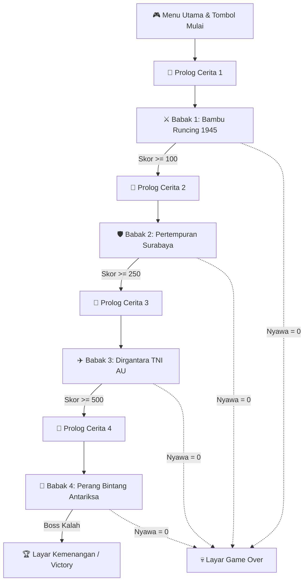

> **💡 Pesan Moral Utama:**  
> *"Kemerdekaan direbut dengan keberanian bambu runcing dan persatuan, namun kedaulatan masa depan bangsa dijaga dengan sains, teknologi, dan kecintaan pada tanah air."*

### Tata Letak Antarmuka (Interface Layout):
```
  ┌─────────────────────────────────────────────────────────────┐
  │ [❤️ ❤️ ❤️] Nyawa: 3        [⭐ Skor: 0150]       [Babak 1/4] │ <── HUD (Layer Depan)
  ├─────────────────────────────────────────────────────────────┤
  │                                                             │
  │                      AREA ARENA GAME                        │
  │                                                             │
  │    [Pejuang] ───>                     <─── [Musuh]          │
  │                                                             │
  ├─────────────────────────────────────────────────────────────┤
  │ 💬 [Narasi]: "Tahun 1945... [Tekan SPASI / KLIK utk Lanjut]" │ <── Kotak Dialog
  └─────────────────────────────────────────────────────────────┘
```

---

## 3. BAGAN TERPISAH: KONFIGURASI VARIABEL GLOBAL

Buat variabel berikut di menu **Variables (Oranye)** dengan opsi **"For all sprites" (Global)**:

### A. Bagan Master Nilai Awal Variabel (Reset State)
```
                  BAGAN INISIALISASI VARIABEL GLOBAL
  ┌─────────────────┬──────────┬─────────────┬───────────────────────────────┐
  │ Nama Variabel   │ Palet    │ Nilai Awal  │ Momen Reset / Pengisian       │
  ├─────────────────┼──────────┼─────────────┼───────────────────────────────┤
  │ GameState       │ 🟠 Oranye│ "Menu"      │ Saat ⚑ Diklik                 │
  │ Score           │ 🟠 Oranye│ 0           │ Saat Tombol Play Diklik       │
  │ Lives           │ 🟠 Oranye│ 3           │ Saat Tombol Play Diklik       │
  │ CurrentLevel    │ 🟠 Oranye│ 1           │ Saat Tombol Play Diklik       │
  └─────────────────┴──────────┴─────────────┴───────────────────────────────┘
```

### B. Bagan Matriks Syarat Naik Babak (*Level Progression Target*)
| Babak / Level | Judul Babak | Target Pemicu Naik Babak | Pesan Siaran (*Broadcast*) |
| :---: | :--- | :--- | :--- |
| **Babak 1** | Gema Bambu Runcing 1945 | `Score >= 100` (10 Infanteri) | `broadcast [Level_Clear v]` |
| **Babak 2** | Bara Api Surabaya 10 Nov | `Score >= 250` (Rebut Pos) | `broadcast [Level_Clear v]` |
| **Babak 3** | Kedaulatan Udara TNI AU | `Score >= 500` (Pesawat Boss Jatuh) | `broadcast [Level_Clear v]` |
| **Babak 4** | Perang Bintang Masa Depan | `Boss_HP <= 0` (Kalah Total) | `broadcast [Level_Clear v]` |

---

## 4. 🎯 DITARUH DI: `STAGE (PANGGUNG)`
> **Peran:** Sebagai konduktor utama pengatur alur game, musik latar, dan perpindahan 4 babak.  
> **Total Script:** Terdapat **4 Stack Blok Terpisah** di area panggung.

---

### 📌 Stack 1 dari 4 (di Stage): Inisialisasi & Menu Pembuka
* **Fungsi:** Mengosongkan variabel lama, memasang latar menu, dan menyalakan musik latar pembuka.

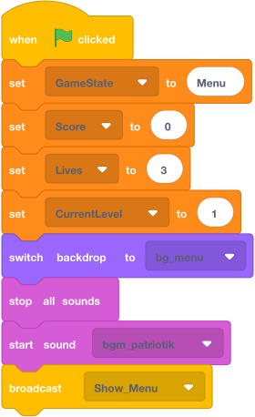

---

### 📌 Stack 2 dari 4 (di Stage): Mulai Permainan Baru (Start Game)
* **Fungsi:** Menampilkan cerita Babak 1 dan menunggu pemain membaca sebelum aksi babak 1 dimulai.

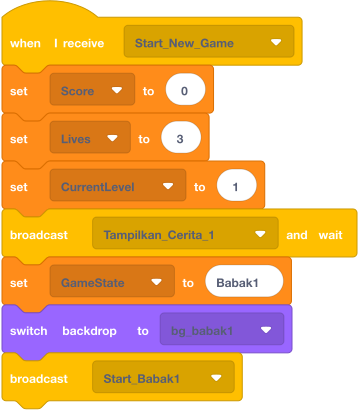

---

### 📌 Stack 3 dari 4 (di Stage): Manajer Kenaikan 4 Babak (*Level Progression*)
* **Fungsi:** Memeriksa nomor level dan memajukan pemain ke babak berikutnya secara bertahap hingga menang.

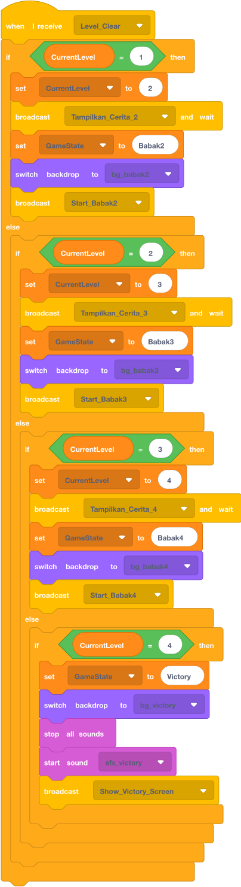

---

### 📌 Stack 4 dari 4 (di Stage): Penangan Layar Kalah (*Game Over*)
* **Fungsi:** Menghentikan permainan dan memutar efek suara kekalahan saat nyawa habis.

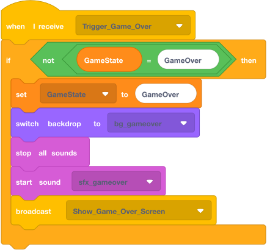

---

## 5. 🎯 DITARUH DI: `Sprite: UI_Button_Play`
> **Peran:** Tombol "MULAI" di layar utama yang bisa diklik pemain.  
> **Total Script:** Terdapat **4 Stack Blok Terpisah** di area kode Sprite ini.

### 📌 Stack 1 & 2: Pengaturan Tampil / Sembunyi Tombol
* **Fungsi:** Sembunyi saat baru dibuka, dan muncul di posisi tengah bawah panggung saat menu utama aktif.

  
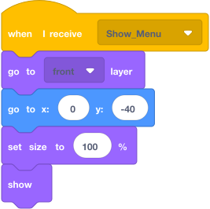

---

### 📌 Stack 3 & 4: Respon Klik & Sembunyi Saat Kalah/Menang
* **Fungsi:** Mengirim broadcast `Start_New_Game` saat diklik pemain, dan otomatis sembunyi saat babak dimulai/kalah/menang.

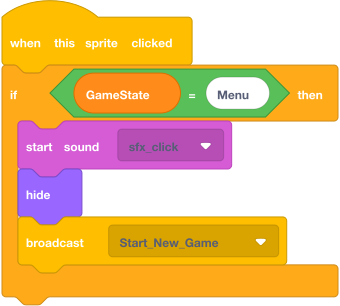  
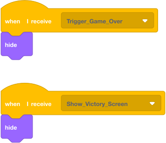

---

## 6. 🎯 DITARUH DI: `Sprite: Dialog_Box`
> **Peran:** Kotak narasi cerita di bagian bawah panggung yang menyampaikan pesan moral dan prolog tiap babak.  
> **Total Script:** Terdapat **5 Stack Blok Terpisah** di area kode Sprite ini.

### 📌 Stack 1: Inisialisasi Sembunyi Awal


---

### 📌 Stack 2: Narasi Cerita Babak 1 (Awal Kemerdekaan 1945)
* **Teks Narasi:** *"Tahun 1945: Penjajah datang kembali. Berbekal bambu runcing dan tekad baja, para pejuang bangkit! (Tekan SPASI / Klik)"*

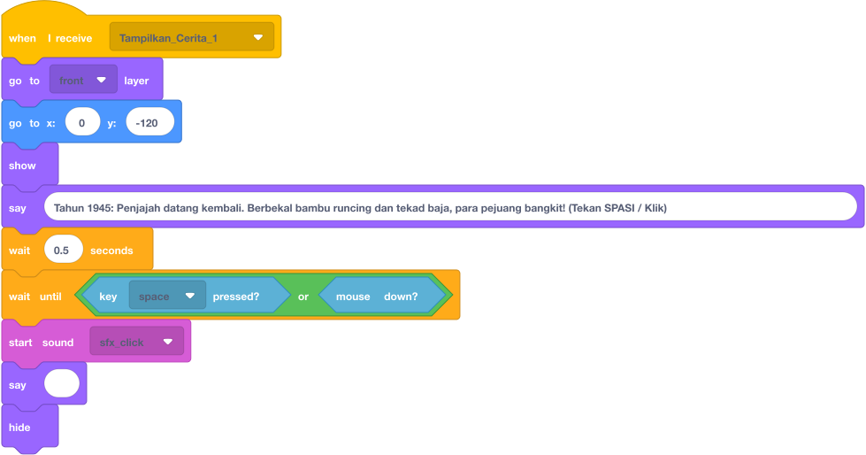

---

### 📌 Stack 3: Narasi Cerita Babak 2 (Pertempuran Surabaya 10 Nov)
* **Teks Narasi:** *"10 November 1945: Arek-arek Suroboyo dan TNI bersatu di Jembatan Merah. Pertahankan kedaulatan! (Tekan SPASI / Klik)"*

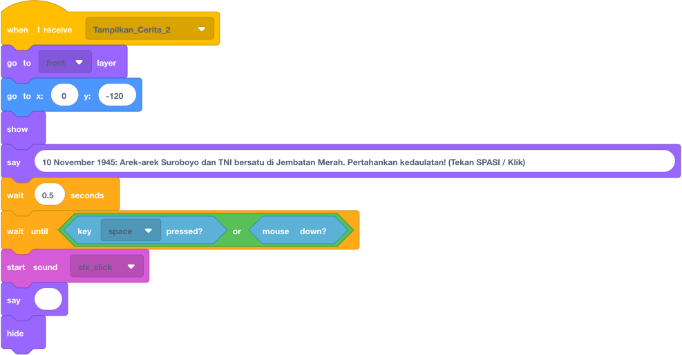

---

### 📌 Stack 4: Narasi Cerita Babak 3 (Dirgantara TNI AU)
* **Teks Narasi:** *"Kedaulatan Dirgantara: Rajawali TNI AU mengudara menjaga langit Nusantara! (Tekan SPASI / Klik)"*

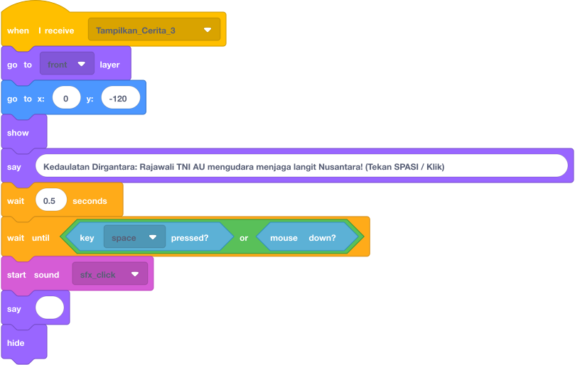

---

### 📌 Stack 5: Narasi Cerita Babak 4 (Perang Bintang Masa Depan)
* **Teks Narasi:** *"Masa Depan: Sains & teknologi antariksa menjadi benteng kedaulatan bangsa di semesta! (Tekan SPASI / Klik)"*

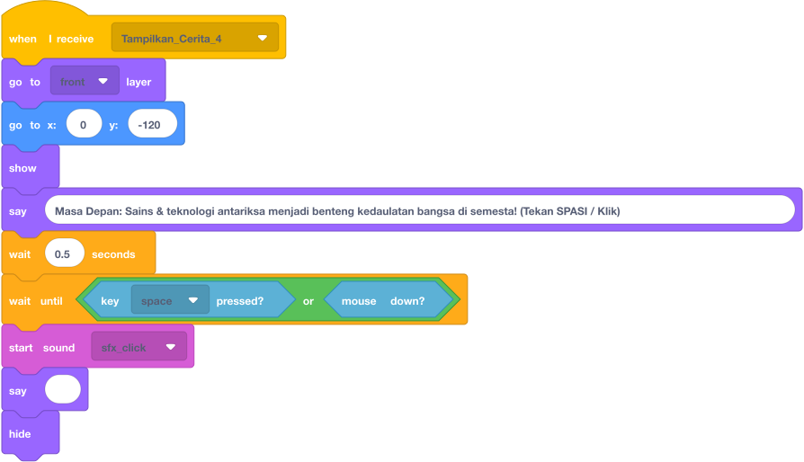

---

## 7. 🎯 DITARUH DI: `Sprite: HUD_Hearts`
> **Peran:** Menampilkan visual 3 nyawa hati di pojok kiri atas panggung `(-180, 155)`.  
> **Daftar Kostum:** Siapkan 4 kostum: `3_hati`, `2_hati`, `1_hati`, dan `0_hati`.  
> **Total Script:** Terdapat **2 Stack Blok Terpisah** di area kode Sprite ini.

### 📌 Stack 1 & Stack 2: Pemantau Nyawa Pemain Secara Real-Time
* **Fungsi:** Otomatis berganti kostum hati saat variabel `Lives` berkurang, dan memicu broadcast `Trigger_Game_Over` saat nyawa habis.

  
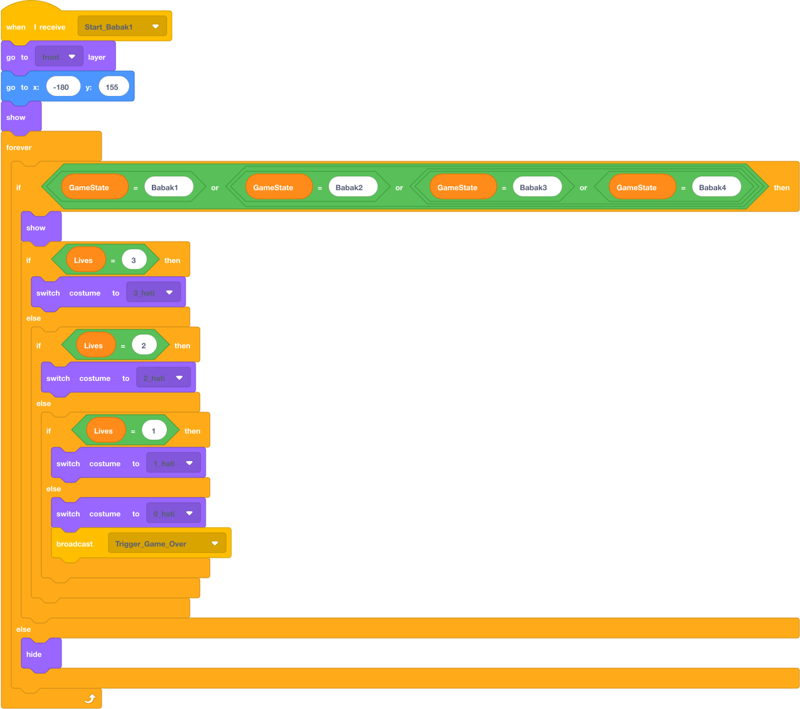

---

## 8. 🎯 DITARUH DI: `Sprite: Victory_Screen`
> **Peran:** Menampilkan pesan kemenangan akhir setelah menamatkan Babak 4.  
> **Total Script:** Terdapat **2 Stack Blok Terpisah** di area kode Sprite ini.

### 📌 Stack 1 & Stack 2: Layar Kemenangan Epik
* **Fungsi:** Muncul di tengah panggung `(0, 0)` membawa pesan moral perjuangan bangsa.

  
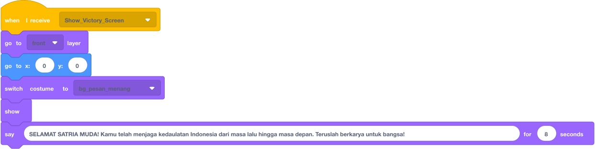

---

## 9. TABEL DEBUGGING & ANTI-BUG GUIDE (SOLUSI KESALAHAN UMUM)

| Gejala Bug / Masalah | Penyebab Teknis | Solusi Perbaikan di Scratch |
| :--- | :--- | :--- |
| **Prolog Cerita terlewat cepat tanpa terbaca.** | Salah menggunakan `broadcast` biasa. | Ganti pemicu di Stage menjadi `[🟡 broadcast ... and wait]`. |
| **Balon dialog tetap nempel di panggung.** | Tidak ada perintah pembersih balon teks. | Pasang `[🟣 say []]` (kolom kosong) sebelum blok `[🟣 hide]`. |
| **Tombol Play tertutup gambar latar.** | Tidak diatur urutan lapisan layarnya. | Tambahkan blok `[🟣 go to [front] layer]` sebelum `show`. |
| **Suara Game Over berisik bertumpuk-tumpuk.** | Nyawa 0 memicu broadcast tanpa henti di forever loop. | Bungkus dengan `if <not <(GameState) = [GameOver]>>` di Stage. |
| **Skor/Nyawa tidak kembali normal saat main ulang.** | Lupa script reset di bendera hijau. | Pastikan `set [Score] to (0)` dan `set [Lives] to (3)` ada di Stage saat ⚑ diklik. |

---

## 10. CHECKLIST PRAKTIK SISWA DI KELAS EKSTRA

Minta siswa memberi centang `[x]` setelah menyusun masing-masing objek:

- [ ] **Stage (Panggung):** Sudah terpasang 4 Stack gambar blok asli.
- [ ] **Sprite UI_Button_Play:** Sudah terpasang 4 Stack blok dan posisinya di `(0, -40)`.
- [ ] **Sprite Dialog_Box:** Sudah terpasang 5 Stack blok narasi cerita 4 babak.
- [ ] **Sprite HUD_Hearts:** Sudah memiliki 4 kostum hati dan 2 Stack blok pemantau.
- [ ] **Sprite Victory_Screen:** Sudah terpasang 2 Stack blok dan siap saat menang.
