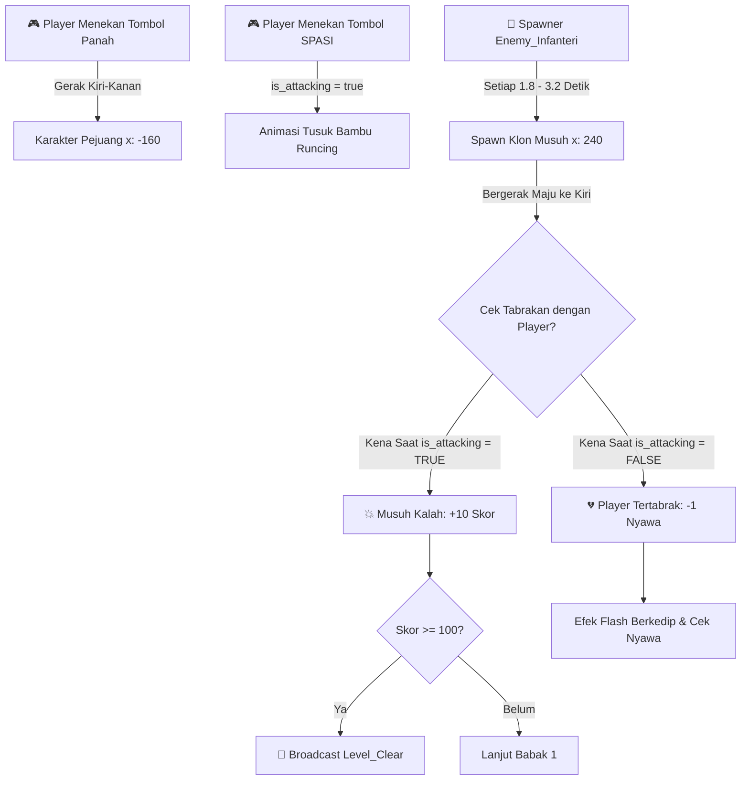
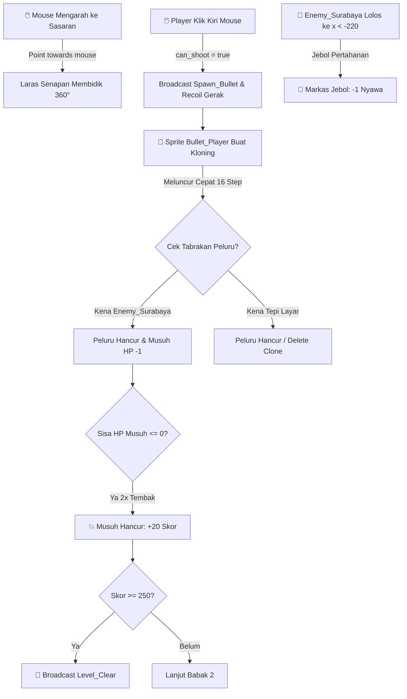
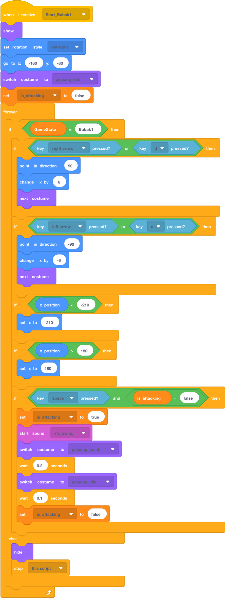
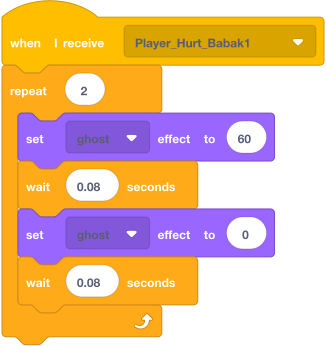
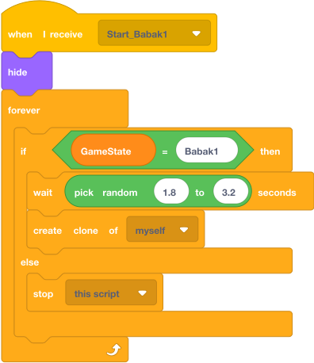
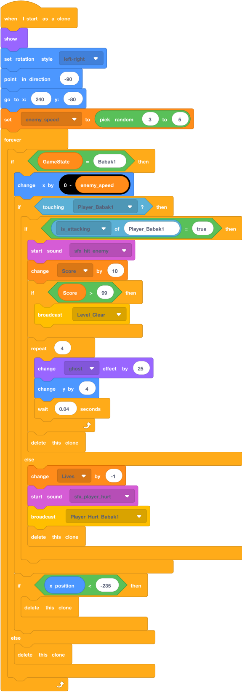
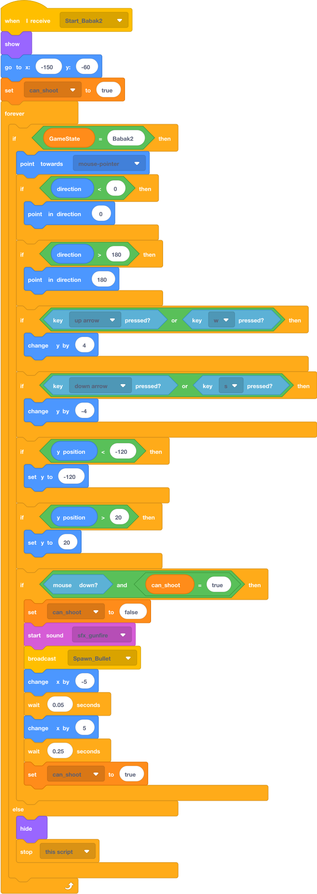
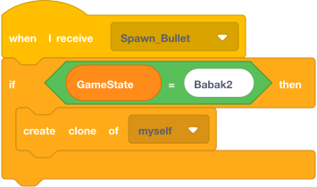
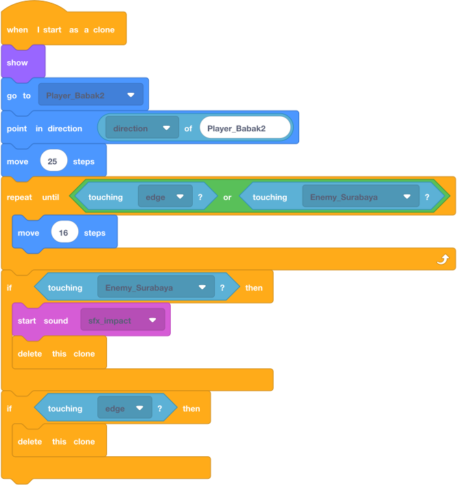
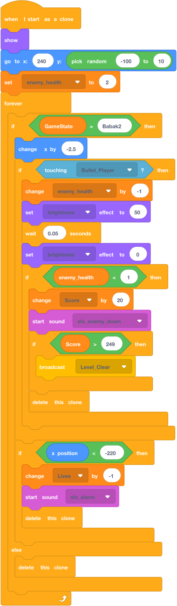

# MODUL 02: PRAKTEK CODING BABAK 1 & BABAK 2
**Panduan Pemrograman Visual Scratch — OISEN 2026**  
**Alur Cerita:** Dari Perjuangan Fisik Awal Kemerdekaan Menuju Pertempuran Surabaya 10 November 1945  
**Format:** Visual Puzzle Blok Scratch 3.0 Resmi (Dilengkapi Bagan Alur Mekanik & Gambar Blok Asli)

---

## 1. PETA PENEMPATAN BLOK KODE (SPRITE BABAK 1 & 2)

Berikut adalah daftar seluruh objek sprite dan jumlah tumpukan (*stack*) balok kode untuk Babak 1 dan Babak 2:

```
┌─────────────────────────────────────────────────────────────────────────────┐
│                 DAFTAR OBJEK SPRITE & PENEMPATAN KODE                       │
├───────────────────────────────┬──────────────┬──────────────────────────────┤
│ Nama Objek di Scratch         │ Tipe Objek   │ Jumlah Stack Blok Kode       │
├───────────────────────────────┼──────────────┼──────────────────────────────┤
│ 1. Sprite: Player_Babak1      │ Tokoh Utama  │ 3 Stack (Melee & Gerak)      │
│ 2. Sprite: Enemy_Infanteri    │ Musuh Klon   │ 3 Stack (Spawner & Hitbox)   │
│ 3. Sprite: Player_Babak2      │ Tokoh Utama  │ 2 Stack (Mouse Aim Shooter)  │
│ 4. Sprite: Bullet_Player      │ Proyektil    │ 3 Stack (Peluru Klon Cepat)  │
│ 5. Sprite: Enemy_Surabaya     │ Musuh Klon   │ 3 Stack (Musuh 2x Darah)     │
└───────────────────────────────┴──────────────┴──────────────────────────────┘
```

---

## 2. BAGAN MASTER: ALUR MEKANIK & KONFIGURASI VARIABEL

### A. Bagan Alur Sistem Pertarungan Babak 1 (Melee Combat Loop)



---

### B. Bagan Alur Sistem Tembak & Proyektil Babak 2 (Precision Shooter Loop)



---

### C. Bagan Tabel Konfigurasi Variabel (Global & Lokal)

```
                 BAGAN VARIABEL KHUSUS BABAK 1 & 2
  ┌─────────────────┬───────────────┬──────────┬─────────────┬───────────────────────────┐
  │ Nama Variabel   │ Cakupan       │ Palet    │ Nilai Awal  │ Fungsi & Penggunaan       │
  ├─────────────────┼───────────────┼──────────┼─────────────┼───────────────────────────┤
  │ Score           │ Global (Semua)│ 🟠 Oranye│ 0           │ Akumulasi poin pemain.    │
  │ Lives           │ Global (Semua)│ 🟠 Oranye│ 3           │ Sisa nyawa pemain.        │
  │ GameState       │ Global (Semua)│ 🟠 Oranye│ "Menu"      │ Status babak aktif.       │
  │ is_attacking    │ Lokal (Player)│ 🟠 Oranye│ false       │ Penanda pejuang menusuk.  │
  │ enemy_speed     │ Lokal (Enemy) │ 🟠 Oranye│ 3 s/d 5     │ Variasi laju tiap musuh.  │
  │ can_shoot       │ Lokal (Player)│ 🟠 Oranye│ true        │ Cooldown jeda menembak.   │
  │ enemy_health    │ Lokal (Enemy) │ 🟠 Oranye│ 2           │ Daya tahan musuh babak 2. │
  └─────────────────┴───────────────┴──────────┴─────────────┴───────────────────────────┘
```
> *Catatan: Variabel Lokal dibuat dengan mencentang opsi **"For this sprite only"** saat Make a Variable.*

---

# BAGIAN 3: BABAK 1 — "GEMA BAMBU RUNCING" (1945)

## 3.1. 🎯 DITARUH DI: `Sprite: Player_Babak1`
> **Karakter:** Pejuang kemerdekaan berotot tanpa baju, bersenjatakan bambu runcing.  
> **Kostum:** Siapkan 2 kostum utama: `pejuang_idle` (siaga) dan `pejuang_tusuk` (dorong bambu).  
> **Total Script:** Terdapat **3 Stack Blok Terpisah** di area kode Sprite ini.

---

### 📌 Stack 1 dari 3: Inisialisasi Sembunyi Awal
* **Fungsi:** Sembunyi saat bendera hijau diklik agar tidak tampil di menu utama.


---

### 📌 Stack 2 dari 3: Pergerakan Halus & Animasi Tusuk Bambu Runcing
* **Kontrol:** Tombol Panah Kanan/Kiri atau `A`/`D` untuk bergerak, Tombol `SPASI` untuk menusuk.



---

### 📌 Stack 3 dari 3: Efek Visual Berkedip Saat Terluka (*Hurt Flash*)
* **Fungsi:** Memberikan respon visual berkedip (*ghost effect*) saat pejuang terkena musuh.



---

## 3.2. 🎯 DITARUH DI: `Sprite: Enemy_Infanteri`
> **Karakter:** Pasukan infanteri penjajah Belanda yang berpatroli dari kanan ke kiri.  
> **Total Script:** Terdapat **3 Stack Blok Terpisah** di area kode Sprite ini.

---

### 📌 Stack 1 dari 3: Inisialisasi Sembunyi Sprite Induk


---

### 📌 Stack 2 dari 3: Spawner Pembuat Kloning Musuh
* **Fungsi:** Menelurkan 1 musuh baru setiap 1.8 hingga 3.2 detik selama Babak 1 aktif.



---

### 📌 Stack 3 dari 3: Logika Gerak Klon, Hitbox Tusukan, & Pengurangan Nyawa
* **Fungsi:** Musuh berjalan ke kiri. Jika ditusuk saat `is_attacking = true`, musuh kalah (+10 Skor). Jika menabrak pejuang yang tidak menyerang, nyawa berkurang (-1 Hati).



---

# BAGIAN 4: BABAK 2 — "BARA API SURABAYA" (10 NOV 1945)

## 4.1. 🎯 DITARUH DI: `Sprite: Player_Babak2`
> **Karakter:** Pejuang berseragam militer TNI Surabaya memegang senapan.  
> **Total Script:** Terdapat **2 Stack Blok Terpisah** di area kode Sprite ini.

---

### 📌 Stack 1 dari 2: Inisialisasi Sembunyi Awal


---

### 📌 Stack 2 dari 2: Bidikan Mouse 360°, Gerak Taktis, & Hentakan Tembak (*Recoil*)
* **Kontrol:** Senjata membidik mengikuti kursor mouse, tombol `W`/`S` atau Panah Atas/Bawah untuk mengatur posisi, dan Klik Mouse untuk menembak.



---

## 4.2. 🎯 DITARUH DI: `Sprite: Bullet_Player`
> **Peran:** Proyektil peluru senapan berkecepatan tinggi yang meluncur ke arah bidikan.  
> **Total Script:** Terdapat **3 Stack Blok Terpisah** di area kode Sprite ini.

---

### 📌 Stack 1 & 2: Inisialisasi Sembunyi & Penangkap Perintah Tembak
* **Fungsi:** Menerima broadcast `Spawn_Bullet` dari pemain lalu membuat klon peluru baru.

  


---

### 📌 Stack 3 dari 3: Luncuran Peluru Kloning & Deteksi Tabrakan
* **Fungsi:** Peluru meluncur lurus mengikuti arah hadap laras senjata dan lenyap saat mengenai musuh / tepi layar.



---

## 4.3. 🎯 DITARUH DI: `Sprite: Enemy_Surabaya`
> **Karakter:** Pasukan penjajah kota Surabaya yang lebih tangguh (memerlukan **2x tembakan** peluru untuk dikalahkan).  
> **Total Script:** Terdapat **3 Stack Blok Terpisah** di area kode Sprite ini.

---

### 📌 Stack 1 & 2: Inisialisasi Sembunyi & Spawner Musuh Surabaya
  


---

### 📌 Stack 3 dari 3: Logika Ketahanan 2x Darah & Deteksi Jebol Pertahanan
* **Fungsi:** Setiap terkena peluru, darah musuh berkurang 1 dan tubuhnya berkedip terang. Jika musuh berhasil menembus sampai ujung kiri panggung `x < -220`, pemain kehilangan 1 nyawa.



---

## 5. BANK PROMPT AI ASET VISUAL (BABAK 1 & 2)

Siswa dapat menyalin prompt ini ke **Bing Image Creator / Canva / Leonardo AI** saat lomba:

```text
PROMPT 1: PEJUANG BAMBU RUNCING (BABAK 1)
2D clean cartoon game character sprite, 1945 Indonesian freedom fighter hero, brave muscular young man, shirtless, red-and-white headband, holding sharpened bamboo spear in forward thrusting pose, side view, full body, isolated on pure white background, flat vector illustration, video game asset style.

PROMPT 2: MUSUH INFANTERI BELANDA (BABAK 1)
2D vector game sprite, colonial dutch infantry soldier 1945, khaki military uniform, vintage army helmet, holding rifle, marching side view pose, isolated on pure white background, clean outlines, video game enemy asset.

PROMPT 3: PEJUANG TNI SURABAYA (BABAK 2)
2D game sprite, Indonesian army soldier 1945 battle of Surabaya, green military uniform, holding vintage rifle aiming straight, side view action pose, isolated on pure white background, crisp vector game art.

PROMPT 4: LATAR HUTAN & DESA 1945 (BACKDROP BABAK 1)
2D side-scrolling video game background, lush bamboo forest and traditional Indonesian village huts, morning sunlight, historical 1945 revolution atmosphere, cartoon flat landscape art.

PROMPT 5: LATAR KOTA SURABAYA 1945 (BACKDROP BABAK 2)
2D side-scroller game background, battle of Surabaya 10 November 1945, colonial brick buildings with smoke and dramatic red sunset sky, sandbag barricades, historical game art.
```

---

## 6. TABEL DEBUGGING & ANTI-BUG GUIDE (KHUSUS BABAK 1 & 2)

| Gejala Bug / Masalah | Penyebab Teknis | Solusi Perbaikan di Scratch |
| :--- | :--- | :--- |
| **Bambu runcing melukai musuh padahal tidak ditekan Spasi.** | Variabel `is_attacking` tidak diatur `false` di luar animasi. | Pastikan `set [is_attacking] to [false]` terpasang sebelum dan sesudah `wait`. |
| **Klon musuh menumpuk dan berhenti muncul setelah beberapa saat.** | Lupa memasang `[delete this clone]` saat klon keluar layar. | Pasang `if <(x position) < (-235)> then delete this clone` di akhir loop. |
| **Peluru keluar dari tempat acak, bukan dari ujung moncong senapan.** | Titik pusat (*costume center point*) peluru/pejuang tidak pas. | Buka Costume Editor, posisikan titik silang tepat di tengah sprite. |
| **Musuh Babak 1 tetap muncul saat sudah masuk Babak 2.** | Loop spawner tidak memeriksa kondisi `GameState = Babak1`. | Bungkus spawner dengan `if <(GameState) = [Babak1]>` dan pasang `stop this script`. |
| **Karakter Pejuang berputar terbalik saat menghadap ke kiri.** | Gaya rotasi belum disetel. | Pasang blok `[🔵 set rotation style [left-right v]]` di awal script. |

---

## 7. LEMBAR UJI MANDIRI SISWA (SELF-TESTING RUBRIC)

Berikan checklist ini kepada siswa untuk memvalidasi Babak 1 dan Babak 2:

- [ ] **Animasi Tusuk:** Bambu runcing hanya melukai musuh saat tombol `Spasi` ditekan.
- [ ] **Batasan Layar:** Pejuang tidak bisa menembus batas kiri `x: -210` dan batas kanan `x: 180`.
- [ ] **Transisi Babak 1 $\rightarrow$ 2:** Saat Skor mencapai 100, game beralih ke Cerita 2 & latar Surabaya.
- [ ] **Bidikan Mouse:** Senapan pejuang berputar mengikuti kursor mouse tanpa terbalik aneh.
- [ ] **Peluru Meluncur:** Peluru meluncur lurus sesuai arah hadap dan lenyap setelah kena musuh.
- [ ] **Darah Musuh Babak 2:** Musuh Surabaya memerlukan 2x tembakan peluru sebelum hancur.
- [ ] **Pembersihan Klon:** Tidak ada klon musuh Babak 1 yang tertinggal saat Babak 2 dimulai.
