# MODUL 03: PRAKTEK CODING BABAK 3 & BABAK 4
**Panduan Pemrograman Visual Scratch — OISEN 2026**  
**Alur Cerita:** Dari Pertempuran Udara Dirgantara TNI AU Menuju Perang Bintang Penjaga Kedaulatan Masa Depan  
**Format:** Visual Puzzle Blok Scratch 3.0 Resmi (Dilengkapi Bagan Alur Mekanik & Gambar Blok Asli)

---

## 1. PETA PENEMPATAN BLOK KODE (SPRITE BABAK 3 & 4)

Berikut adalah daftar seluruh objek sprite dan jumlah tumpukan (*stack*) balok kode untuk Babak 3 dan Babak 4:

```
┌─────────────────────────────────────────────────────────────────────────────┐
│                 DAFTAR OBJEK SPRITE & PENEMPATAN KODE                       │
├───────────────────────────────┬──────────────┬──────────────────────────────┤
│ Nama Objek di Scratch         │ Tipe Objek   │ Jumlah Stack Blok Kode       │
├───────────────────────────────┼──────────────┼──────────────────────────────┤
│ 1. Sprite: Player_Plane_Babak3│ Pesawat TNI  │ 3 Stack (Manuver Udara & SFX)│
│ 2. Sprite: Bullet_Air         │ Peluru Udara │ 3 Stack (Proyektil Lurus)    │
│ 3. Sprite: Enemy_Plane        │ Pesawat Musuh│ 3 Stack (Pola Meliuk Sinus)  │
│ 4. Sprite: Cloud_Scroller     │ Latar Awan   │ 3 Stack (Parallax Scrolling) │
│ 5. Sprite: Player_Space_Babak4│ Jet Antariksa│ 3 Stack (Sci-Fi Laser Mecha) │
│ 6. Sprite: Laser_Player       │ Laser Plasma │ 3 Stack (Proyektil Cepat)    │
│ 7. Sprite: Boss_Antariksa     │ Final Boss   │ 3 Stack (AI Patrol & HP 20)  │
│ 8. Sprite: Boss_Laser_Enemy   │ Laser Musuh  │ 3 Stack (Hujan Laser Musuh)  │
└───────────────────────────────┴──────────────┴──────────────────────────────┘
```

---

## 2. BAGAN MASTER: ALUR MEKANIK & KONFIGURASI VARIABEL

### A. Bagan Alur Sistem Pertempuran Udara Babak 3 (Dogfight Loop)

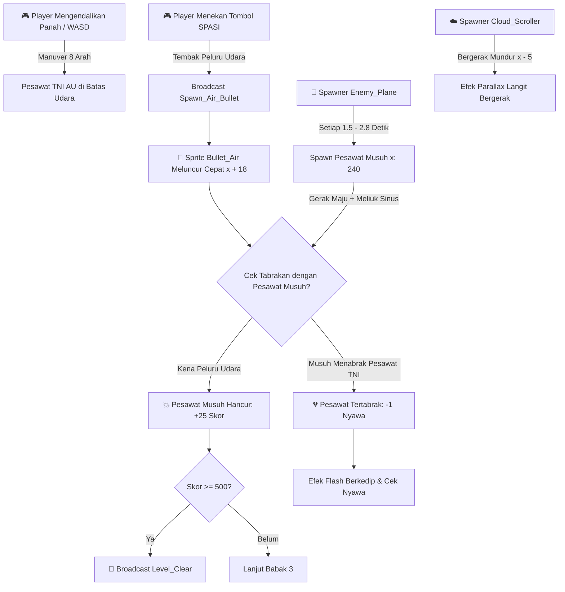

---

### B. Bagan Alur Sistem Boss Fight Antariksa Babak 4 (Sci-Fi Boss Loop)

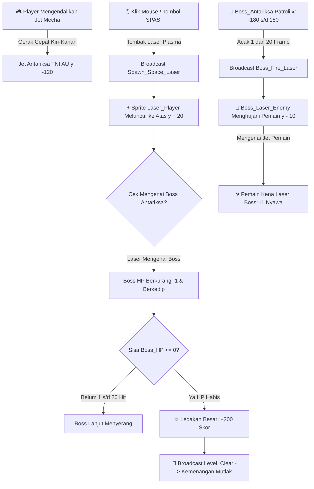

---

### C. Bagan Tabel Konfigurasi Variabel Babak 3 & 4

```
                 BAGAN VARIABEL KHUSUS BABAK 3 & 4
  ┌─────────────────┬───────────────┬──────────┬─────────────┬───────────────────────────┐
  │ Nama Variabel   │ Cakupan       │ Palet    │ Nilai Awal  │ Fungsi & Penggunaan       │
  ├─────────────────┼───────────────┼──────────┼─────────────┼───────────────────────────┤
  │ Score           │ Global (Semua)│ 🟠 Oranye│ (Lanjutan)  │ Akumulasi total skor.     │
  │ Lives           │ Global (Semua)│ 🟠 Oranye│ (Lanjutan)  │ Sisa nyawa pemain.        │
  │ GameState       │ Global (Semua)│ 🟠 Oranye│ "Menu"      │ Status babak aktif.       │
  │ enemy_speed     │ Lokal (Enemy) │ 🟠 Oranye│ 4 s/d 7     │ Kecepatan pesawat musuh.  │
  │ Boss_HP         │ Lokal (Boss)  │ 🟠 Oranye│ 20          │ Total darah Final Boss.   │
  │ boss_dir        │ Lokal (Boss)  │ 🟠 Oranye│ 5           │ Arah patroli gerak Boss.  │
  └─────────────────┴───────────────┴──────────┴─────────────┴───────────────────────────┘
```

---

# BAGIAN 3: BABAK 3 — "KEDAULATAN DIRGANTARA" (TNI AU)

## 3.1. 🎯 DITARUH DI: `Sprite: Player_Plane_Babak3`
> **Karakter:** Pesawat tempur TNI AU dengan kamuflase militer dan lambang Merah Putih di sayap.  
> **Total Script:** Terdapat **3 Stack Blok Terpisah** di area kode Sprite ini.

---

### 📌 Stack 1 dari 3: Inisialisasi Sembunyi Awal


---

### 📌 Stack 2 dari 3: Kendali Manuver Udara 8 Arah & Tembakan Peluru Udara
* **Kontrol:** Tombol Panah atau `WASD` untuk bermanuver di langit, Tombol `SPASI` untuk menembak peluru udara.

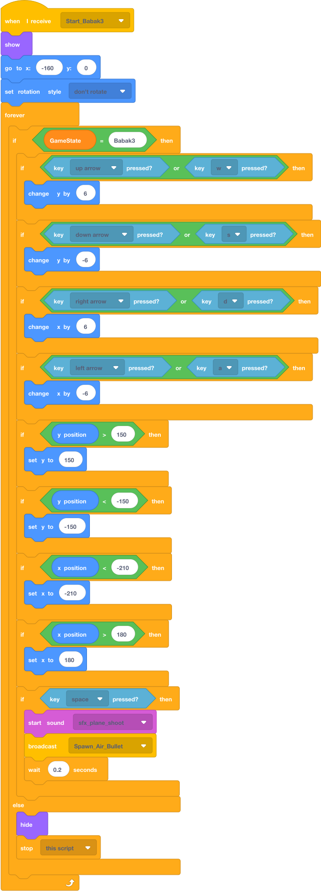

---

### 📌 Stack 3 dari 3: Efek Visual Berkedip Saat Tertembak (*Hurt Flash*)
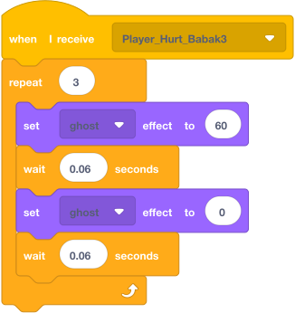

---

## 3.2. 🎯 DITARUH DI: `Sprite: Bullet_Air`
> **Peran:** Peluru proyektil lurus berkecepatan tinggi yang ditembakkan dari pesawat TNI AU.  
> **Total Script:** Terdapat **3 Stack Blok Terpisah** di area kode Sprite ini.

---

### 📌 Stack 1 & 2: Inisialisasi Sembunyi & Penangkap Perintah Tembak
  
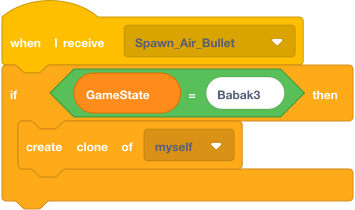

---

### 📌 Stack 3 dari 3: Luncuran Peluru & Deteksi Tabrakan
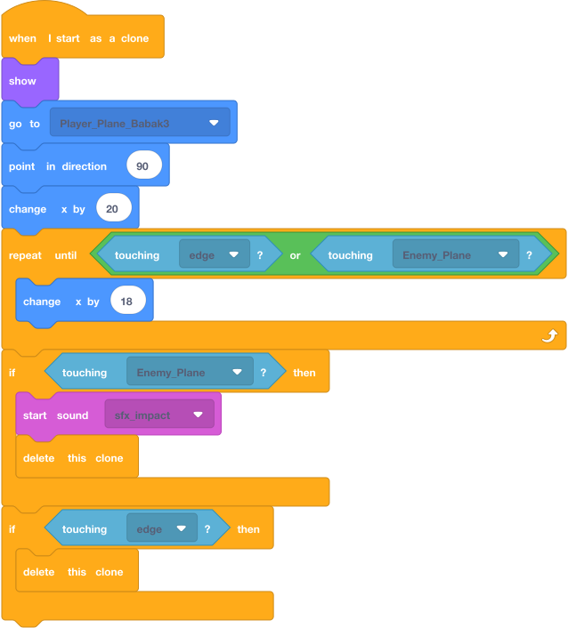

---

## 3.3. 🎯 DITARUH DI: `Sprite: Enemy_Plane`
> **Karakter:** Skuadron pesawat tempur penjajah yang bermanuver meliuk (*sine wave*).  
> **Total Script:** Terdapat **3 Stack Blok Terpisah** di area kode Sprite ini.

---

### 📌 Stack 1 & 2: Inisialisasi Sembunyi & Spawner Pesawat Musuh
  


---

### 📌 Stack 3 dari 3: Logika Gerak Meliuk Sinus & Penghancuran Pesawat (+25 Skor)
* **Target Skor Babak 3:** Menembak jatuh armada musuh hingga mencapai **Skor 500** untuk membuka Babak 4.

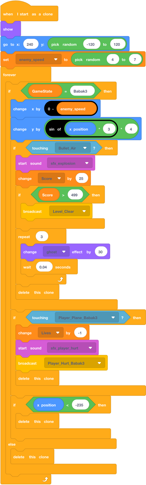

---

## 3.4. 🎯 DITARUH DI: `Sprite: Cloud_Scroller`
> **Peran:** Efek visual lapisan awan bergerak (*Parallax Scrolling Sky*) di latar belakang.  
> **Total Script:** Terdapat **3 Stack Blok Terpisah** di area kode Sprite ini.

---

### 📌 Stack 1 & 2: Inisialisasi Sembunyi & Spawner Awan
  
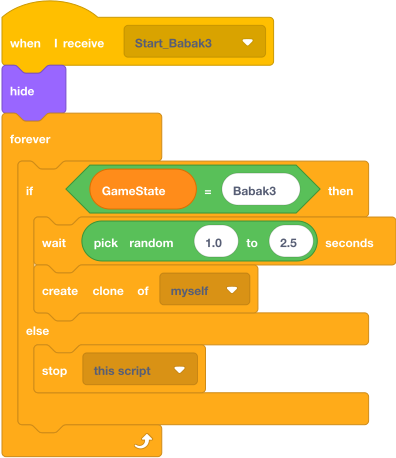

---

### 📌 Stack 3 dari 3: Luncuran Awan Transparan di Lapisan Belakang (*Back Layer*)
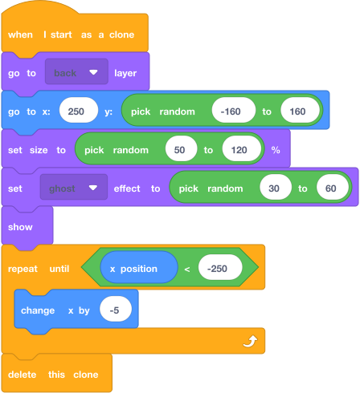

---

# BAGIAN 4: BABAK 4 — "PERANG BINTANG" (MASA DEPAN & BOSS FIGHT)

## 4.1. 🎯 DITARUH DI: `Sprite: Player_Space_Babak4`
> **Karakter:** Jet Luar Angkasa Futuristik TNI AU (Desain Mecha Cyber Jet).  
> **Total Script:** Terdapat **3 Stack Blok Terpisah** di area kode Sprite ini.

---

### 📌 Stack 1 dari 3: Inisialisasi Sembunyi Awal


---

### 📌 Stack 2 dari 3: Kendali Pesawat Antariksa & Tembakan Laser Plasma
* **Kontrol:** Menggerakkan pesawat dengan `Arrow Keys`/`WASD` dan menembakkan laser dengan `Klik Mouse` atau `SPASI`.

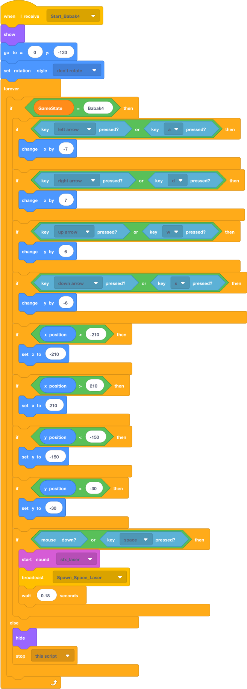

---

### 📌 Stack 3 dari 3: Respon Terkena Laser / Meteor Boss


---

## 4.2. 🎯 DITARUH DI: `Sprite: Laser_Player`
> **Peran:** Sinar laser plasma ganda berkecepatan tinggi yang ditembakkan ke arah Kapal Induk Boss.  
> **Total Script:** Terdapat **3 Stack Blok Terpisah** di area kode Sprite ini.

---

### 📌 Stack 1 & 2: Inisialisasi Sembunyi & Penangkap Perintah Tembak Laser
  
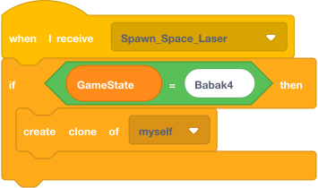

---

### 📌 Stack 3 dari 3: Luncuran Laser Cepat Vertikal ke Arah Boss


---

## 4.3. 🎯 DITARUH DI: `Sprite: Boss_Antariksa`
> **Karakter:** Kapal Induk Antariksa Penjajah Galaksi (*Final Boss*) dengan **20 HP**.  
> **Total Script:** Terdapat **3 Stack Blok Terpisah** di area kode Sprite ini.

---

### 📌 Stack 1 dari 3: Inisialisasi Sembunyi Awal


---

### 📌 Stack 2 dari 3: AI Patroli Bolak-Balik & Pola Serangan Laser
* **Fungsi:** Boss berpatroli kiri-kanan di posisi atas layar `y: 100` dan secara berkala memicu hujan laser merah.

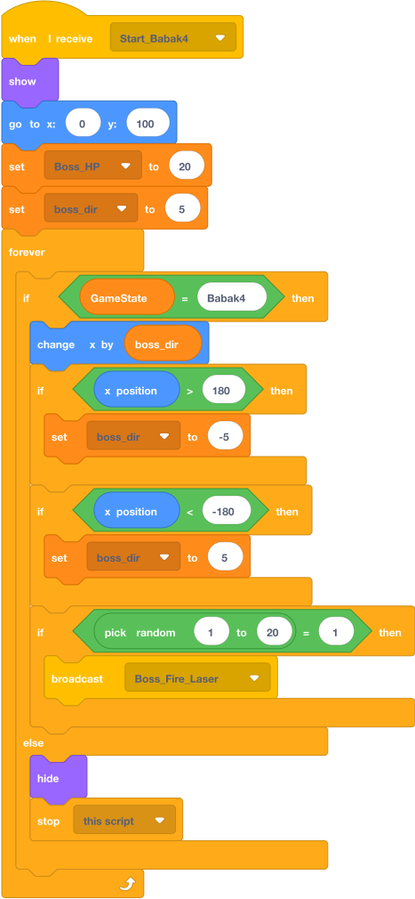

---

### 📌 Stack 3 dari 3: Pengurangan Darah Boss (20 HP) & Ledakan Kemenangan Akhir (+200 Skor)
* **Fungsi:** Setiap terkena laser, darah Boss berkurang 1. Ketika darah habis (`Boss_HP < 1`), memutar suara ledakan raksasa, membesar, menghilang, dan memicu broadcast `Level_Clear` menuju Layar Kemenangan Mutlak!

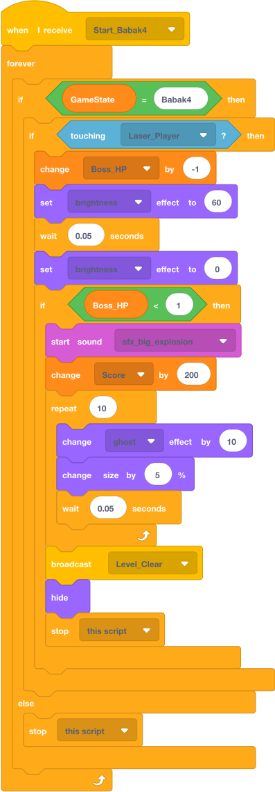

---

## 4.4. 🎯 DITARUH DI: `Sprite: Boss_Laser_Enemy`
> **Peran:** Hujan proyektil laser merah yang ditembakkan oleh Kapal Induk Boss.  
> **Total Script:** Terdapat **3 Stack Blok Terpisah** di area kode Sprite ini.

---

### 📌 Stack 1 & 2: Inisialisasi Sembunyi & Penangkap Perintah Tembak Boss
  
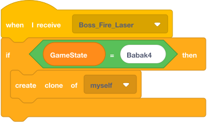

---

### 📌 Stack 3 dari 3: Luncuran Laser Turun ke Bawah & Deteksi Tabrakan Pemain
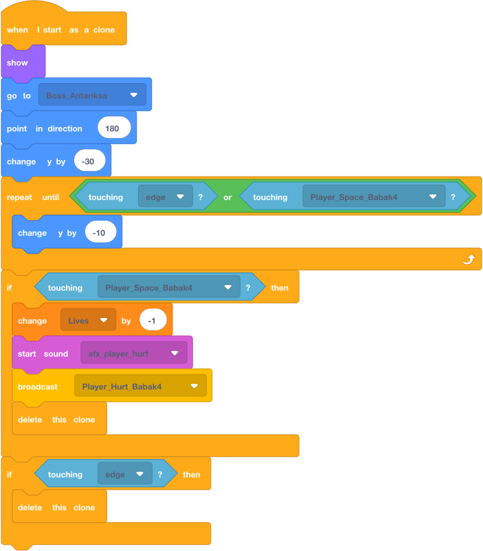

---

## 5. BANK PROMPT AI ASET VISUAL (BABAK 3 & 4)

Siswa dapat langsung menyalin prompt ini ke **Bing Image Creator / Canva / Leonardo AI** saat lomba:

```text
PROMPT 1: PESAWAT TEMPUR TNI AU VINTAGE (BABAK 3)
2D top-down video game sprite, vintage Indonesian air force fighter aircraft, military camouflage green, red-and-white roundel on wings, clean vector outlines, isolated on pure white background, flat game asset.

PROMPT 2: PESAWAT TEMPUR MUSUH UDARA (BABAK 3)
2D top-down video game sprite, colonial military enemy fighter plane, dark grey and yellow stripes, propeller fighter, isolated on pure white background, crisp vector game art.

PROMPT 3: JET MECHA ANTARIKSA FUTURISTIK (BABAK 4)
2D top-down sci-fi spaceship game sprite, sleek cyberpunk mecha jet fighter, glowing cyan energy wings and red thrusters, futuristic Indonesian air force theme, isolated on pure white background, high resolution game asset.

PROMPT 4: KAPAL INDUK FINAL BOSS GALAKSI (BABAK 4)
2D top-down sci-fi mothership boss sprite, menacing alien dreadnought battleship, glowing red plasma cannons, dark metallic armor plating, isolated on pure white background, epic video game boss asset.

PROMPT 5: LATAR LANGIT DIRGANTARA (BACKDROP BABAK 3)
2D top-down video game background, blue sky with fluffy white clouds, view from high altitude, clean cartoon atmosphere, seamless vertical scrolling landscape.

PROMPT 6: LATAR LUAR ANGKASA & BINTANG (BACKDROP BABAK 4)
2D deep space video game background, dark cosmic galaxy with glowing nebulae, distant stars and colorful cosmic dust, sci-fi battle background.
```

---

## 6. TABEL DEBUGGING & ANTI-BUG GUIDE (KHUSUS BABAK 3 & 4)

| Gejala Bug / Masalah | Penyebab Teknis | Solusi Perbaikan di Scratch |
| :--- | :--- | :--- |
| **Awan menutupi pesawat pemain dan musuh.** | Lapisan layar awan berada di depan sprite lain. | Tambahkan blok `[🟣 go to [back v] layer]` di script klon awan. |
| **Darah Boss langsung habis dalam 1 kali tembakan laser.** | Laser tidak dihancurkan setelah mengenai Boss sehingga mengenai terus-menerus. | Pasang `[delete this clone]` pada peluru laser tepat setelah deteksi sentuhan. |
| **Gerakan pesawat musuh kaku atau keluar batas.** | Nilai fungsi sinus tidak dibatasi. | Gunakan rumus `change y by ((sin of ((x position) * 3)) * 4)`. |
| **Laser Boss tidak pernah muncul.** | Pemicu broadcast Boss menggunakan angka yang terlalu jarang. | Gunakan `if <(pick random (1) to (20)) = (1)> then broadcast [Boss_Fire_Laser v]`. |
| **Pesawat Babak 3 tidak hilang saat masuk Babak 4.** | Loop pergerakan tidak memeriksa status `GameState = Babak3`. | Bungkus seluruh loop dengan `if <(GameState) = [Babak3]>` dan pasang `hide` di else. |

---

## 7. LEMBAR UJI MANDIRI SISWA (SELF-TESTING RUBRIC)

Berikan checklist ini kepada siswa untuk memvalidasi Babak 3 dan Babak 4:

- [ ] **Manuver Pesawat Babak 3:** Pesawat bergerak lincah 8 arah dan tidak tembus keluar batas layar panggung.
- [ ] **Efek Parallax Awan:** Awan meluncur di lapisan paling belakang tanpa menutupi pesawat.
- [ ] **Transisi Babak 3 $\rightarrow$ 4:** Saat skor mencapai 500, game beralih ke Cerita 4 dan latar angkasa.
- [ ] **Patroli AI Boss Antariksa:** Kapal induk Boss berpatroli bolak-balik di koordinat `y: 100`.
- [ ] **Darah Boss 20 Hit:** Boss memerlukan 20 kali tembakan laser plasma sebelum meledak.
- [ ] **Hujan Laser Boss:** Boss secara berkala menembakkan laser merah ke arah pemain.
- [ ] **Kemenangan Mutlak:** Setelah Boss meledak (+200 Skor), layar beralih ke Layar Kemenangan Akhir dengan pesan moral kepahlawanan.
