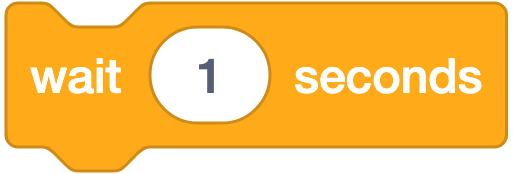
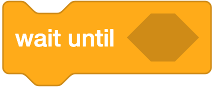
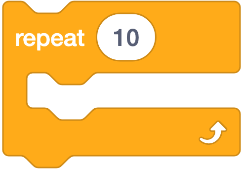
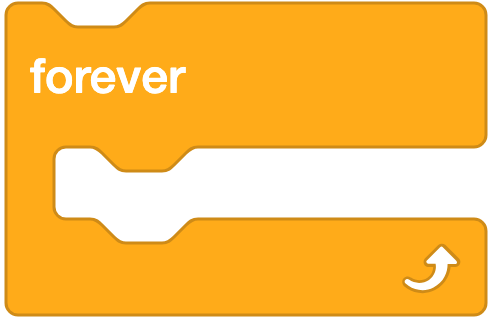
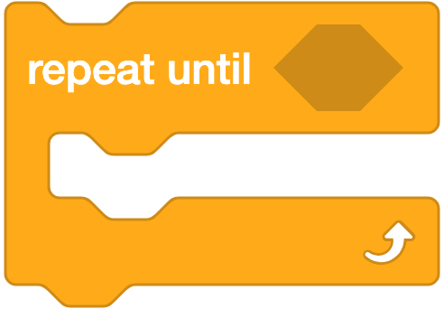
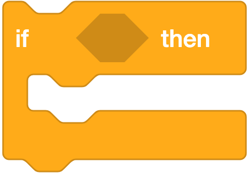
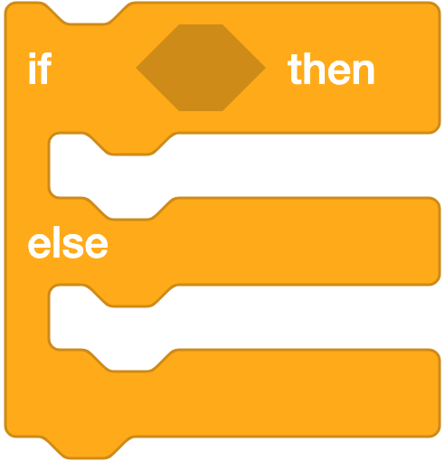
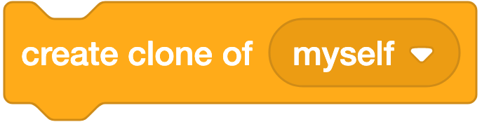
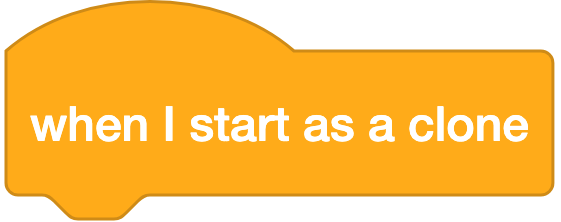

# 🟠 Control (Kontrol) — 11 Blok

**Warna:** Oranye · **Fungsi umum:** mengatur **alur** jalannya program — perulangan, percabangan, jeda, dan klon
**Berlaku untuk:** Sprite dan Stage (kecuali blok klon: Stage tidak bisa diklon).

> Kategori ini berisi **inti berpikir komputasional**: *loop* dan *conditional*. Dua konsep ini ada di semua bahasa pemrograman.

---

## Ringkasan Cepat

| Kelompok | Blok | Bentuk |
|---|---|---|
| **Jeda** | `wait () seconds`, `wait until <>` | ▭ stack |
| **Perulangan** | `repeat ()`, `forever`, `repeat until <>` | ⊂ C-block |
| **Percabangan** | `if <> then`, `if <> then else` | ⊂ C-block |
| **Penghenti** | `stop ()` | ▬ cap |
| **Klon** | `when I start as a clone`, `create clone of ()`, `delete this clone` | ⌒ / ▭ / ▬ |

---

## A. Blok Jeda

### 1. `wait (1) seconds`



**Artinya:** Menjeda program selama 1 detik sebelum lanjut ke blok berikutnya.
**Bentuk:** ▭ stack
**Fungsi:** Menghentikan script ini selama N detik, lalu melanjutkan.
**Parameter:** boleh desimal, mis. `0.1`.
**Contoh — animasi berkedip:**
```
forever
  hide
  wait (0.5) seconds
  show
  wait (0.5) seconds
```
**Catatan:** Blok yang **hanya menjeda script ini**; script lain tetap berjalan. Nilai kecil seperti `0.1` dipakai untuk mengatur kecepatan animasi.

---

### 2. `wait until <>`



**Artinya:** Menahan program sampai syarat di dalamnya benar, baru lanjut.
**Bentuk:** ▭ stack
**Fungsi:** Menghentikan script sampai kondisi di lubang segi enam menjadi **benar**.
**Contoh — menunggu pemain menekan spasi:**
```
say [Tekan spasi untuk mulai]
wait until <key (space) pressed?>
say [Mulai!] for (1) seconds
```
**Catatan:** Lebih hemat daripada `repeat until <>` kosong. Jika kondisinya tidak pernah benar, script akan menunggu selamanya — sering jadi penyebab program "macet".

---

## B. Blok Perulangan (Loop)

### 3. `repeat (10)`



**Artinya:** Mengulang blok di dalam pelukannya tepat 10 kali, lalu berhenti.
**Bentuk:** ⊂ C-block
**Fungsi:** Mengulang blok di dalamnya **sebanyak N kali**, lalu melanjutkan ke bawah.
**Contoh — menggambar persegi:**
```
repeat (4)
  move (100) steps
  turn ↻ (90) degrees
```
**Catatan:** Ini *counted loop* — jumlah pengulangannya sudah diketahui sejak awal. Rumus segi-n: `repeat (n)` + `turn ↻ (360/n) degrees`.

---

### 4. `forever`



**Artinya:** Mengulang blok di dalamnya terus-menerus dan tidak pernah berhenti sendiri.
**Bentuk:** ⊂ C-block (bawahnya **rata**, tidak bisa disambung)
**Fungsi:** Mengulang blok di dalamnya **selamanya**, sampai proyek dihentikan.
**Contoh:**
```
when ⚑ clicked
forever
  move (5) steps
  if on edge, bounce
```
**Catatan penting:**
- Tidak ada blok yang bisa dipasang **di bawah** `forever` — jelaskan bahwa bentuknya sengaja dibuat rata karena tidak akan pernah selesai.
- Untuk mengecek sesuatu terus-menerus (input tombol, tabrakan), pola `forever` + `if` adalah pola paling sering dipakai dalam permainan.
- Tanpa `wait` di dalamnya, `forever` tetap aman — Scratch menjalankannya satu putaran per frame.

---

### 5. `repeat until <>`



**Artinya:** Mengulang terus sampai syaratnya benar, baru berhenti.
**Bentuk:** ⊂ C-block
**Fungsi:** Mengulang **selama kondisi masih salah**; berhenti begitu kondisi menjadi benar.
**Contoh — bergerak sampai menyentuh tepi:**
```
repeat until <touching (edge)?>
  move (10) steps
say [Sampai!]
```
**Catatan:** Perhatikan logikanya **terbalik** dari kebiasaan bahasa lain (`while` mengulang selama benar). Di Scratch: mengulang **sampai** benar. Ini sumber kebingungan yang perlu ditegaskan.

---

## C. Blok Percabangan (Conditional)

### 6. `if <> then`



**Artinya:** Menjalankan blok di dalamnya HANYA kalau syaratnya benar.
**Bentuk:** ⊂ C-block
**Fungsi:** Menjalankan blok di dalamnya **hanya bila** kondisi bernilai benar. Bila salah, dilewati.
**Contoh:**
```
if <touching (Musuh)?> then
  change (nyawa) by (-1)
```
**Catatan:** Dicek **satu kali** saat blok dilewati. Untuk pengecekan terus-menerus, bungkus dalam `forever`:
```
forever
  if <touching (Musuh)?> then
    change (nyawa) by (-1)
```

---

### 7. `if <> then ... else ...`



**Artinya:** Kalau syaratnya benar jalankan bagian atas; kalau salah, jalankan bagian bawah.
**Bentuk:** ⊂ C-block (dua ruang)
**Fungsi:** Menjalankan bagian pertama bila kondisi benar, bagian kedua (**else**) bila salah.
**Contoh — kuis:**
```
ask [Berapa 5 + 3?] and wait
if <(answer) = (8)> then
  say [Benar!] for (2) seconds
else
  say [Salah, coba lagi] for (2) seconds
```
**Catatan:** Salah satu bagian **pasti** dijalankan — tidak mungkin keduanya, tidak mungkin tidak ada. Untuk lebih dari dua pilihan, susun `if-else` bersarang (*nested*).

---

## D. Blok Penghenti

### 8. `stop (all ▾)`


**Artinya:** Menghentikan program. Bisa dipilih: semua script, script ini saja, atau script lain.
**Bentuk:** ▬ cap (berubah jadi ▭ stack bila memilih `other scripts in sprite`)
**Fungsi:** Menghentikan script.
**Parameter (dropdown):**

| Pilihan | Yang dihentikan |
|---|---|
| `all` | **Seluruh** script di semua sprite — sama seperti menekan tombol ⛔ |
| `this script` | Hanya script tempat blok ini berada |
| `other scripts in sprite` | Semua script lain di sprite ini, kecuali script ini sendiri |

**Contoh:**
```
if <(nyawa) = (0)> then
  say [Game Over] for (2) seconds
  stop (all)
```
**Catatan:** Hanya opsi `other scripts in sprite` yang berbentuk stack (bisa disambung ke bawah), karena dua opsi lain memang mengakhiri jalannya script.

---

## E. Blok Klon (Clone)

**Klon** = salinan sprite yang dibuat **saat proyek berjalan**. Masing-masing punya kode, kostum, dan **variabel lokal sendiri**.

### 9. `create clone of (myself ▾)`



**Artinya:** Membuat salinan sprite yang bisa jalan sendiri. Cocok untuk peluru atau musuh banyak.
**Bentuk:** ▭ stack
**Fungsi:** Membuat satu klon baru.
**Parameter (dropdown):** `myself` (dirinya sendiri) atau nama sprite lain.
**Contoh — hujan bintang:**
```
when ⚑ clicked
hide
forever
  create clone of (myself)
  wait (0.5) seconds
```
**Catatan:** Klon mewarisi posisi, arah, ukuran, kostum, efek, dan nilai variabel lokal dari induknya **pada saat diklon**.

---

### 10. `when I start as a clone`



**Artinya:** Blok di bawahnya jalan tiap kali sebuah salinan baru lahir.
**Bentuk:** ⌒ hat
**Fungsi:** Script yang dijalankan **oleh setiap klon** begitu klon itu lahir.
**Contoh — lanjutan hujan bintang:**
```
when I start as a clone
go to x: (pick random (-240) to (240)) y: (180)
show
repeat until <(y position) < (-170)>
  change y by (-5)
delete this clone
```
**Catatan:** Blok ini **hanya berjalan pada klon**, tidak pernah pada sprite aslinya. Inilah kunci membuat banyak objek serupa (peluru, musuh, koin) tanpa menggandakan sprite secara manual.

---

### 11. `delete this clone`


**Artinya:** Menghapus salinan ini supaya tidak menumpuk dan membuat proyek berat.
**Bentuk:** ▬ cap
**Fungsi:** Menghapus klon yang sedang menjalankan blok ini.
**Catatan:**
- **Tidak berpengaruh** bila dijalankan oleh sprite asli.
- **WAJIB dipakai.** Klon yang tidak pernah dihapus akan menumpuk; batas Scratch adalah **300 klon aktif**, dan setelahnya `create clone of` diabaikan diam-diam sehingga permainan tampak "rusak".
- Semua klon otomatis hilang saat proyek dihentikan.

---

## Pola-Pola Penting

### Pola 1 — Mesin permainan (paling sering dipakai)
```
when ⚑ clicked
forever
  if <key (right arrow) pressed?> then
    change x by (10)
  if <touching (Musuh)?> then
    broadcast (game over)
```

### Pola 2 — Peluru dengan klon
```
[di sprite Peluru]
when I receive (tembak)
create clone of (myself)

when I start as a clone
go to (Pemain)
show
repeat until <touching (edge)?>
  change y by (10)
delete this clone
```

### Pola 3 — Percabangan bertingkat (nilai huruf)
```
if <(nilai) > (85)> then
  say [A]
else
  if <(nilai) > (70)> then
    say [B]
  else
    say [C]
```

---

## Kesalahan Umum

| Kesalahan | Gejala | Perbaikan |
|---|---|---|
| `if` tanpa dibungkus `forever` | Tabrakan/tombol hanya dicek sekali lalu tidak lagi | Bungkus dengan `forever` |
| Mencoba menyambung blok di bawah `forever` | Tidak bisa menempel | Jelaskan `forever` tidak pernah selesai; taruh blok itu **di dalam** loop |
| Lupa `delete this clone` | Permainan makin lambat lalu klon berhenti muncul (batas 300) | Selalu akhiri hidup klon |
| Salah paham `repeat until` | Loop berjalan terbalik dari harapan | Tekankan: mengulang **sampai** benar, bukan **selama** benar |
| `wait until <>` dengan kondisi mustahil | Program tampak macet | Cek ulang kondisinya |
| `stop (all)` di tengah script yang masih perlu jalan | Semua berhenti mendadak | Pakai `stop (this script)` bila hanya ingin menghentikan satu script |
| Terlalu banyak `wait` di dalam loop game | Kontrol terasa berat | Kurangi/hilangkan `wait` pada loop kontrol |

---

## Latihan Bertingkat

| Level | Tantangan | Blok kunci |
|---|---|---|
| ⭐ | Kucing berkedip 10 kali | `repeat`, `show`, `hide`, `wait` |
| ⭐ | Menggambar segitiga & segi enam | `repeat`, `turn` |
| ⭐⭐ | Sprite bergerak terus dan memantul | `forever`, `if on edge bounce` |
| ⭐⭐ | Kuis benar/salah | `if-else`, `ask and wait` |
| ⭐⭐ | Bergerak sampai menyentuh garis finis | `repeat until` |
| ⭐⭐⭐ | Hujan koin dengan klon | `create clone of`, `when I start as a clone`, `delete this clone` |
| ⭐⭐⭐ | Permainan tembak-tembakan | ketiga blok klon + `broadcast` |

---

## Cek Pemahaman

1. Apa beda `repeat (10)` dengan `forever`?
2. Mengapa tidak ada blok yang bisa dipasang di bawah `forever`?
3. `repeat until <touching (edge)?>` — kapan loop ini **berhenti**?
4. Apa akibatnya jika klon tidak pernah dihapus dengan `delete this clone`?
5. Blok apa yang harus dipakai agar setiap klon menjalankan kodenya sendiri?

<details>
<summary>Kunci jawaban</summary>

1. `repeat (10)` mengulang tepat 10 kali lalu berhenti; `forever` mengulang tanpa akhir sampai proyek dihentikan.
2. Karena `forever` tidak pernah selesai, jadi blok setelahnya tidak akan pernah dijalankan — bentuknya sengaja dibuat rata.
3. Berhenti begitu sprite **menyentuh tepi** (kondisinya menjadi benar).
4. Klon menumpuk sampai batas 300; setelah itu klon baru tidak terbuat dan permainan tampak rusak, serta proyek melambat.
5. `when I start as a clone`.
</details>
