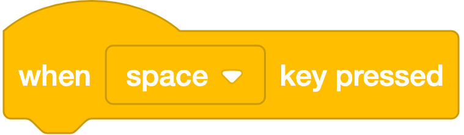
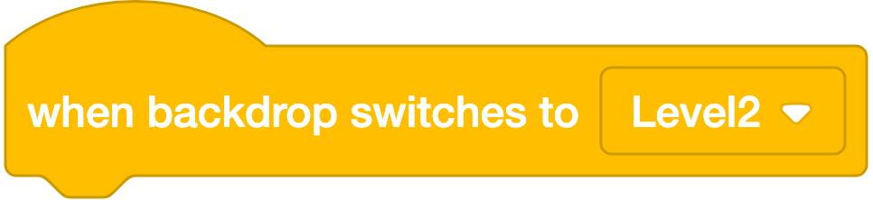
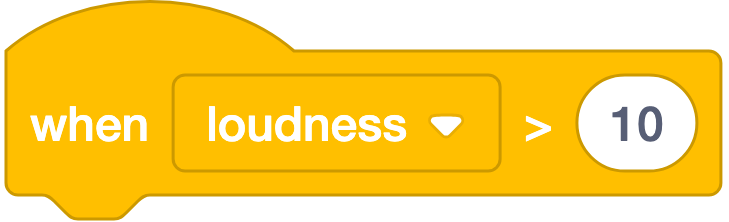
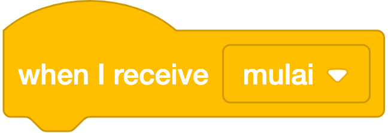
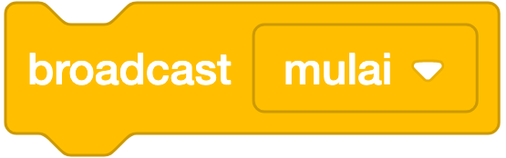
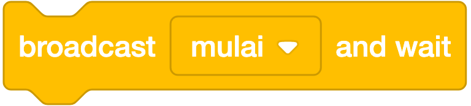

# 🟡 Events (Kejadian) — 9 Blok

**Warna:** Kuning · **Fungsi umum:** menentukan **kapan** sebuah script mulai berjalan
**Berlaku untuk:** Sprite dan Stage (dengan sedikit perbedaan).

> **Kategori paling penting untuk pemula.** Tanpa blok Events, script tidak akan pernah berjalan sendiri. Aturan kelas: **setiap script diawali blok kuning.**

---

## Ringkasan Cepat

| Bentuk | Blok | Pemicu |
|---|---|---|
| ⌒ hat | `when ⚑ clicked` | Bendera hijau diklik |
| ⌒ hat | `when () key pressed` | Tombol keyboard ditekan |
| ⌒ hat | `when this sprite clicked` | Sprite diklik |
| ⌒ hat | `when stage clicked` | Panggung diklik *(versi Stage)* |
| ⌒ hat | `when backdrop switches to ()` | Latar berganti |
| ⌒ hat | `when () > ()` | Sensor melewati ambang |
| ⌒ hat | `when I receive ()` | Menerima pesan siaran |
| ▭ stack | `broadcast ()` | — (mengirim pesan) |
| ▭ stack | `broadcast () and wait` | — (mengirim & menunggu) |

---

## A. Blok Pemicu (Hat Blocks)

### 1. `when ⚑ clicked`


**Artinya:** Semua blok di bawahnya jalan begitu bendera hijau ditekan. Ini pintu masuk program.
**Bentuk:** ⌒ hat
**Fungsi:** Menjalankan script di bawahnya saat **bendera hijau** ditekan.
**Contoh:**
```
when ⚑ clicked
go to x: (0) y: (0)
say [Mulai!] for (2) seconds
```
**Catatan:**
- Boleh dipakai **berkali-kali** dalam satu sprite. Semua script yang memakainya berjalan **bersamaan** (paralel).
- Ini blok **wajib** untuk script reset.
- Kalau siswa mengeluh "tidak terjadi apa-apa saat bendera diklik", 90% penyebabnya blok ini tidak ada.

---

### 2. `when (space ▾) key pressed`



**Artinya:** Blok di bawahnya jalan tiap kali tombol yang dipilih ditekan.
**Bentuk:** ⌒ hat
**Fungsi:** Menjalankan script saat tombol keyboard tertentu ditekan.
**Parameter (dropdown):** `space`, `up/down/left/right arrow`, huruf `a–z`, angka `0–9`, dan `any` (tombol apa saja).
**Contoh:**
```
when (space) key pressed
change y by (50)
```
**Catatan penting — jebakan pada game:**
Blok ini punya **jeda ulang** seperti saat kita menahan tombol di aplikasi pengetikan: tekan → jalan sekali → jeda sesaat → baru berulang. Akibatnya gerakan terasa **tersendat**.

Untuk kontrol permainan yang mulus, gunakan pola Sensing di dalam `forever`:
```
when ⚑ clicked
forever
  if <key (right arrow) pressed?> then
    change x by (10)
```
> Ini salah satu perbedaan paling berguna untuk diajarkan di kelas game.

---

### 3. `when this sprite clicked`


**Artinya:** Blok di bawahnya jalan tiap sprite ini diklik. Cocok untuk membuat tombol.
**Bentuk:** ⌒ hat
**Fungsi:** Menjalankan script saat sprite tersebut **diklik** pemain.
**Contoh — tombol permainan:**
```
when this sprite clicked
start sound (Pop)
change (skor) by (1)
```
**Catatan:** Sprite yang sedang `hide` **tidak bisa diklik**. Klik terdeteksi hanya pada bagian gambar yang tidak transparan.

---

### 4. `when stage clicked`


**Artinya:** Blok di bawahnya jalan tiap panggungnya yang diklik, bukan spritenya.
**Bentuk:** ⌒ hat
**Fungsi:** Versi blok no. 3 yang muncul **saat Stage yang dipilih** — dipicu ketika latar (bukan sprite) diklik.
**Catatan:** Blok ini menggantikan `when this sprite clicked` di palet Stage. Itulah sebabnya jumlah blok Events kadang disebut 8, kadang 9.

---

### 5. `when backdrop switches to (Level2 ▾)`



**Artinya:** Blok di bawahnya jalan tiap latar berganti ke backdrop itu. Berguna untuk pindah level.
**Bentuk:** ⌒ hat
**Fungsi:** Menjalankan script saat latar panggung berganti ke backdrop tertentu.
**Contoh — musuh muncul di level 2:**
```
when backdrop switches to (Level2)
show
go to x: (200) y: (0)
```
**Catatan:** Cara paling rapi membuat **permainan berlevel** atau **cerita berbabak**: Stage mengatur babak, tiap sprite bereaksi sendiri. Tidak terpicu bila backdrop diganti ke latar yang **sudah** aktif.

---

### 6. `when (loudness ▾) > (10)`



**Artinya:** Blok di bawahnya jalan kalau suara di sekitar melebihi angka itu. Perlu mikrofon.
**Bentuk:** ⌒ hat
**Fungsi:** Menjalankan script saat nilai sensor **melampaui** ambang batas.
**Parameter (dropdown):**

| Pilihan | Arti |
|---|---|
| `loudness` | Tingkat suara dari **mikrofon** (0–100) |
| `timer` | Waktu berjalan sejak proyek dimulai (detik) |

**Contoh — bertepuk tangan untuk membuat sprite melompat:**
```
when (loudness) > (30)
change y by (50)
```
**Catatan:** Memerlukan **izin mikrofon** dari browser. Sangat disukai siswa karena interaktif — cocok untuk demo "coding yang bisa mendengar".

---

### 7. `when I receive (mulai ▾)`



**Artinya:** Blok di bawahnya jalan begitu pesan itu disiarkan. Cara sprite saling memberi aba-aba.
**Bentuk:** ⌒ hat
**Fungsi:** Menjalankan script saat **pesan siaran** (*broadcast*) tertentu diterima.
**Parameter (dropdown):** daftar pesan yang ada + pilihan **New message** untuk membuat pesan baru.
**Contoh:**
```
when I receive (game over)
hide
stop all sounds
```
**Catatan:** Semua sprite **dan** Stage bisa menerima pesan yang sama. Satu pesan bisa memicu banyak script sekaligus.

---

## B. Blok Pengirim Pesan

### 8. `broadcast (mulai ▾)`



**Artinya:** Menyiarkan pesan ke semua sprite lalu langsung lanjut, tanpa menunggu.
**Bentuk:** ▭ stack
**Fungsi:** Mengirim pesan siaran ke seluruh proyek, lalu **langsung melanjutkan** tanpa menunggu.
**Contoh:**
```
when ⚑ clicked
say [Bersiap...] for (2) seconds
broadcast (mulai permainan)
```
**Catatan:** Ini mekanisme **komunikasi antar-sprite** di Scratch. Sprite tidak bisa memerintah sprite lain secara langsung — mereka "berteriak" lewat pesan, dan siapa pun yang punya `when I receive` akan menanggapi.

---

### 9. `broadcast (mulai ▾) and wait`



**Artinya:** Menyiarkan pesan lalu menunggu sampai semua penerimanya selesai bekerja.
**Bentuk:** ▭ stack
**Fungsi:** Mengirim pesan lalu **menunggu sampai semua script penerima selesai**, baru melanjutkan.
**Contoh — cerita berurutan rapi:**
```
when ⚑ clicked
broadcast (babak1) and wait
broadcast (babak2) and wait
broadcast (tamat) and wait
```
**Catatan:** Inilah cara membuat urutan adegan yang tidak saling menyerobot. Bandingkan dengan `broadcast` biasa yang membuat semua babak berjalan bersamaan dan berantakan.

---

## Konsep Kunci: Broadcast = "Pengeras Suara Sekolah"

> Bayangkan pengumuman lewat pengeras suara sekolah.
> - **`broadcast`** = petugas mengumumkan "Upacara dimulai!" lalu langsung pergi mengerjakan hal lain.
> - **`when I receive`** = tiap kelas mendengar dan melakukan tugasnya masing-masing.
> - **`broadcast and wait`** = petugas mengumumkan, lalu **menunggu semua kelas selesai berbaris** dulu sebelum mengumumkan hal berikutnya.

**Kelebihan pola ini:** pengirim tidak perlu tahu siapa yang mendengar. Menambah sprite baru cukup dengan memberinya `when I receive` — script lama tidak perlu diubah sama sekali. Ini konsep *decoupling* yang di dunia profesional muncul sebagai *event bus* / *pub-sub*.

---

## Perbandingan yang Sering Tertukar

| Pasangan | Beda utama |
|---|---|
| `when () key pressed` vs `if <key () pressed?>` | Hat block ada **jeda ulang** (tersendat); Sensing di dalam `forever` **mulus** — pakai untuk game |
| `broadcast` vs `broadcast and wait` | Yang pertama jalan terus; yang kedua menunggu penerima selesai |
| `when ⚑ clicked` vs `when I receive` | Bendera = dipicu pemain; broadcast = dipicu program |
| `when backdrop switches to` vs `when I receive` | Backdrop = pemicu visual (level); broadcast = pemicu logika (bebas) |

---

## Kesalahan Umum

| Kesalahan | Gejala | Perbaikan |
|---|---|---|
| Script tanpa hat block | Bendera hijau diklik, tidak terjadi apa-apa | Tambah `when ⚑ clicked` |
| Kontrol game pakai `when () key pressed` | Gerakan tersendat saat tombol ditahan | Ganti ke `forever` + `if <key () pressed?>` |
| `broadcast` padahal butuh urutan | Adegan tumpang tindih | Pakai `broadcast () and wait` |
| Pesan broadcast diberi nama `message1` | Proyek besar jadi tak terbaca | Beri nama bermakna: `mulai`, `game over`, `level2` |
| `when this sprite clicked` pada sprite yang di-`hide` | Klik tidak berfungsi | Pastikan sprite `show` |
| Lupa memberi izin mikrofon | Blok `loudness` tidak bereaksi | Izinkan mikrofon di browser |

---

## Latihan Bertingkat

| Level | Tantangan | Blok kunci |
|---|---|---|
| ⭐ | Kucing menyapa saat bendera hijau diklik | `when ⚑ clicked` |
| ⭐ | Kucing mengeong saat diklik | `when this sprite clicked` |
| ⭐⭐ | Kucing melompat saat spasi ditekan | `when (space) key pressed` |
| ⭐⭐ | Sprite melompat saat kamu bertepuk tangan | `when (loudness) > ()` |
| ⭐⭐⭐ | Dua sprite berdialog bergantian rapi | `broadcast`, `when I receive` |
| ⭐⭐⭐ | Cerita 3 babak berurutan | `broadcast () and wait` |

---

## Cek Pemahaman

1. Mengapa kontrol permainan sebaiknya **tidak** memakai `when () key pressed`?
2. Apa beda `broadcast` dengan `broadcast and wait`?
3. Berapa sprite yang bisa menanggapi satu pesan `broadcast`?
4. Sprite kamu tidak bereaksi saat diklik. Sebutkan dua kemungkinan penyebabnya.

<details>
<summary>Kunci jawaban</summary>

1. Karena blok itu punya jeda ulang sehingga gerakan tersendat; gunakan `forever` + `if <key () pressed?>` dari kategori Sensing.
2. `broadcast` langsung lanjut tanpa menunggu; `broadcast and wait` menunggu semua script penerima selesai lebih dulu.
3. Tidak terbatas — semua sprite dan Stage yang punya `when I receive` dengan pesan yang sama akan menanggapi.
4. Antara lain: sprite sedang `hide`; script tidak diawali `when this sprite clicked`; bagian yang diklik adalah area transparan kostum.
</details>
