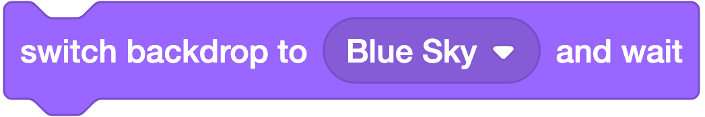
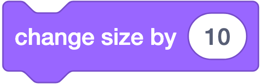
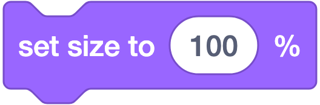
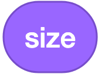
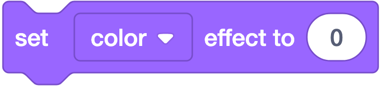
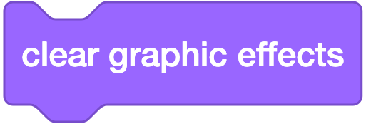

# 🟣 Looks (Tampilan) — 21 Blok

**Warna:** Ungu · **Fungsi umum:** mengatur rupa sprite dan latar panggung
**Catatan:** sebagian blok **khusus Sprite**, sebagian **khusus Stage**, sebagian bisa keduanya.

---

## Ringkasan Cepat

| Kelompok | Blok | Berlaku untuk |
|---|---|---|
| **Berbicara** | `say`, `say for secs`, `think`, `think for secs` | Sprite |
| **Kostum** | `switch costume to`, `next costume`, `(costume)` | Sprite |
| **Backdrop** | `switch backdrop to`, `switch backdrop to and wait`, `next backdrop`, `(backdrop)` | Stage |
| **Ukuran** | `change size by`, `set size to`, `(size)` | Sprite |
| **Terlihat** | `show`, `hide` | Sprite |
| **Lapisan** | `go to layer`, `go layers` | Sprite |
| **Efek grafis** | `change effect by`, `set effect to`, `clear graphic effects` | Sprite & Stage |

---

## A. Blok Berbicara (4 blok)

### 1. `say [Hello!] for (2) seconds`


**Artinya:** Sprite memunculkan balon bicara selama 2 detik, lalu balonnya hilang sendiri.
**Bentuk:** ▭ stack
**Fungsi:** Menampilkan balon bicara berisi teks selama N detik, lalu balon hilang sendiri.
**Parameter:** teks yang diucapkan · durasi dalam detik.
**Contoh:**
```
when ⚑ clicked
say [Selamat datang!] for (2) seconds
say [Ayo mulai!] for (2) seconds
```
**Catatan:** Script **menunggu** sampai durasi habis (*blocking*) — cocok untuk dialog berurutan.

---

### 2. `say [Hello!]`


**Artinya:** Sprite memunculkan balon bicara yang menempel terus sampai diganti.
**Bentuk:** ▭ stack
**Fungsi:** Menampilkan balon bicara **tanpa batas waktu**; balon tetap ada sampai diganti atau dikosongkan.
**Contoh — menampilkan skor secara langsung:**
```
forever
  say (join [Skor: ] (skor))
```
**Catatan:** Cara menghapus balon: `say []` dengan **kolom dikosongkan**. Ini pertanyaan langganan siswa: *"Pak, balonnya nggak mau hilang!"*

---

### 3. `think [Hmm...] for (2) seconds`


**Artinya:** Balon berpikir (bulat-bulat kecil) muncul selama 2 detik lalu hilang.
**Bentuk:** ▭ stack
**Fungsi:** Sama seperti `say for seconds`, tetapi balonnya berbentuk **balon pikiran** (bulatan-bulatan).
**Catatan:** Bagus untuk menunjukkan tokoh sedang berpikir/ragu dalam cerita.

---

### 4. `think [Hmm...]`


**Artinya:** Balon berpikir muncul dan menempel terus sampai diganti.
**Bentuk:** ▭ stack
**Fungsi:** Balon pikiran tanpa batas waktu.

---

## B. Blok Kostum (3 blok — khusus Sprite)

### 5. `switch costume to (costume2 ▾)`


**Artinya:** Mengganti 'baju' atau gambar sprite ke kostum yang dipilih.
**Bentuk:** ▭ stack
**Fungsi:** Mengganti tampilan sprite ke kostum tertentu.
**Parameter (dropdown):** daftar kostum milik sprite tersebut.
**Contoh — animasi 2 pose:**
```
forever
  switch costume to (costume1)
  wait (0.2) seconds
  switch costume to (costume2)
  wait (0.2) seconds
```
**Catatan:** Kolomnya juga bisa diisi **angka** atau blok reporter, misalnya `switch costume to (pick random (1) to (4))`.

---

### 6. `next costume`


**Artinya:** Ganti ke kostum berikutnya. Kalau diulang cepat, sprite terlihat bergerak seperti animasi.
**Bentuk:** ▭ stack
**Fungsi:** Berpindah ke kostum **berikutnya** dalam urutan daftar; setelah kostum terakhir kembali ke yang pertama.
**Contoh — kucing berjalan:**
```
forever
  next costume
  move (10) steps
  wait (0.1) seconds
```
**Catatan:** Blok **paling penting untuk animasi**. Kecepatan animasi diatur lewat `wait`, bukan lewat blok ini. Tanpa `wait`, animasi terlalu cepat sampai terlihat bergetar.

---

### 7. `(costume [number ▾])`


**Artinya:** Memberi tahu sprite sedang memakai kostum nomor berapa (atau namanya apa).
**Bentuk:** ⬭ reporter
**Fungsi:** Melaporkan **nomor** atau **nama** kostum yang sedang dipakai.
**Parameter (dropdown):** `number` (angka urut, mulai dari 1) atau `name` (nama kostum).
**Contoh:**
```
if <(costume [name]) = [terluka]> then
  change (nyawa) by (-1)
```

---

## C. Blok Backdrop (4 blok — khusus/utamanya Stage)

### 8. `switch backdrop to (Blue Sky ▾)`


**Artinya:** Mengganti gambar latar panggung ke backdrop yang dipilih.
**Bentuk:** ▭ stack
**Fungsi:** Mengganti latar belakang panggung.
**Catatan:** Blok ini **juga bisa dipakai dari sprite** — sprite boleh memerintahkan pergantian latar. Sering dipakai untuk pindah level.

---

### 9. `switch backdrop to (Blue Sky ▾) and wait`



**Artinya:** Ganti latar, lalu tunggu dulu sampai semua reaksi latar itu selesai jalan.
**Bentuk:** ▭ stack
**Fungsi:** Mengganti latar, lalu **menunggu** sampai semua script `when backdrop switches to ...` selesai berjalan, baru melanjutkan.
**Catatan:** Versi lanjutan; berguna agar urutan cerita tidak saling mendahului.

---

### 10. `next backdrop`


**Artinya:** Ganti ke gambar latar berikutnya.
**Bentuk:** ▭ stack
**Fungsi:** Berpindah ke backdrop berikutnya, berputar kembali ke awal setelah yang terakhir.
**Contoh — pergantian latar otomatis:**
```
when ⚑ clicked
forever
  next backdrop
  wait (3) seconds
```

---

### 11. `(backdrop [number ▾])`


**Artinya:** Memberi tahu panggung sedang memakai latar nomor berapa (atau namanya apa).
**Bentuk:** ⬭ reporter
**Fungsi:** Melaporkan nomor atau nama backdrop yang sedang tampil.
**Contoh:**
```
if <(backdrop [name]) = [Level3]> then
  set (kesulitan) to (3)
```

---

## D. Blok Ukuran (3 blok — khusus Sprite)

### 12. `change size by (10)`



**Artinya:** Memperbesar sprite 10 persen dari ukuran sekarang. Angka negatif memperkecil.
**Bentuk:** ▭ stack
**Fungsi:** Menambah/mengurangi ukuran sprite sebanyak N **persen** dari ukuran asli.
**Contoh — efek membesar lalu mengecil:**
```
repeat (10)
  change size by (5)
repeat (10)
  change size by (-5)
```

---

### 13. `set size to (100) %`



**Artinya:** Menetapkan ukuran sprite. 100% = ukuran asli, 50% = separuhnya.
**Bentuk:** ▭ stack
**Fungsi:** Menetapkan ukuran sprite dalam persen dari ukuran kostum aslinya.
**Catatan:** `100` = ukuran asli, `50` = setengah, `200` = dua kali. **Wajib ada di script reset**, karena kalau tidak, ukuran sisa dari sesi sebelumnya akan terbawa.

---

### 14. `(size)`



**Artinya:** Memberi tahu ukuran sprite sekarang dalam persen.
**Bentuk:** ⬭ reporter
**Fungsi:** Melaporkan ukuran sprite saat ini dalam persen.
**Contoh — mencegah sprite terlalu besar:**
```
if <(size) < (200)> then
  change size by (10)
```

---

## E. Blok Terlihat / Tersembunyi (2 blok — khusus Sprite)

### 15. `show`


**Artinya:** Memunculkan sprite supaya terlihat lagi di panggung.
**Bentuk:** ▭ stack
**Fungsi:** Menampilkan sprite di panggung.

---

### 16. `hide`


**Artinya:** Menyembunyikan sprite. Sprite tetap ada dan tetap bisa jalan, hanya tak terlihat.
**Bentuk:** ▭ stack
**Fungsi:** Menyembunyikan sprite.
**Catatan penting:** Sprite yang disembunyikan **tetap menjalankan kodenya** — hanya tidak terlihat. Sprite tersembunyi juga **tidak terdeteksi** oleh blok `touching ()?`.
**Jebakan klasik:** siswa memakai `hide` lalu proyek disimpan; sesi berikutnya sprite "hilang". Selalu awali dengan:
```
when ⚑ clicked
show
```

---

## F. Blok Lapisan (2 blok — khusus Sprite)

### 17. `go to (front ▾) layer`


**Artinya:** Menaruh sprite di lapisan paling depan supaya tidak tertutup sprite lain.
**Bentuk:** ▭ stack
**Fungsi:** Memindahkan sprite ke lapisan **paling depan** atau **paling belakang**.
**Contoh:** tokoh utama selalu di depan → `go to [front] layer`.
**Catatan:** Stage **selalu** paling belakang dan tidak bisa diubah.

---

### 18. `go (forward ▾) (1) layers`


**Artinya:** Memindahkan sprite maju 1 lapisan ke depan (atau mundur ke belakang).
**Bentuk:** ▭ stack
**Fungsi:** Menggeser sprite maju/mundur sebanyak N lapisan.
**Contoh:** membuat awan berada di belakang tokoh tetapi di depan latar → `go [backward] (1) layers`.

---

## G. Blok Efek Grafis (3 blok — Sprite & Stage)

### 19. `change (color ▾) effect by (25)`


**Artinya:** Menambah efek warna sebanyak 25 dari nilai sekarang.
**Bentuk:** ▭ stack
**Fungsi:** Menambah nilai efek grafis tertentu.

**7 efek yang tersedia:**

| Efek | Rentang | Hasil visual |
|---|---|---|
| `color` | 0–200 (berulang) | Mengubah warna/rona |
| `fisheye` | −100 ke atas | Melengkung seperti lensa cembung |
| `whirl` | bebas | Terpuntir memutar |
| `pixelate` | 0 ke atas | Kotak-kotak besar |
| `mosaic` | 0–5105 | Banyak salinan kecil |
| `brightness` | −100…100 | −100 hitam, 100 putih |
| `ghost` | 0–100 | 100 = transparan penuh |

**Contoh — efek muncul perlahan:**
```
set (ghost) effect to (100)
show
repeat (20)
  change (ghost) effect by (-5)
```

---

### 20. `set (color ▾) effect to (0)`



**Artinya:** Menetapkan nilai efek langsung. Angka 0 berarti kembali normal.
**Bentuk:** ▭ stack
**Fungsi:** Menetapkan nilai efek secara pasti.
**Catatan:** `set (ghost) effect to (0)` = benar-benar terlihat; `100` = tak terlihat. Berbeda dengan `hide`, sprite ber-ghost 100 **masih terdeteksi** oleh blok `touching ()?` — trik berguna untuk membuat area tabrakan tak kasatmata.

---

### 21. `clear graphic effects`



**Artinya:** Menghapus SEMUA efek sekaligus supaya sprite kembali normal.
**Bentuk:** ▭ stack
**Fungsi:** Menghapus **semua** efek grafis sekaligus, mengembalikan tampilan normal.
**Catatan:** Wajib masuk script reset. Tanpa ini, sprite bisa tetap buram/aneh dari percobaan sebelumnya.

---

## Script Reset Lengkap (gabungan Motion + Looks)

Ajarkan pola ini sebagai kebiasaan wajib di setiap proyek:

```
when ⚑ clicked
show
clear graphic effects
set size to (100) %
switch costume to (costume1)
go to x: (0) y: (0)
point in direction (90)
```

---

## Kesalahan Umum

| Kesalahan | Gejala | Perbaikan |
|---|---|---|
| Balon `say` tidak mau hilang | Teks menempel selamanya | Pakai `say []` kosong, atau `say ... for () seconds` |
| `next costume` tanpa `wait` | Animasi bergetar terlalu cepat | Tambah `wait (0.1) seconds` |
| Lupa `show` di awal | Sprite "hilang" | Tambahkan script reset |
| Efek ghost/mosaic tertinggal | Sprite tampak aneh | Tambah `clear graphic effects` |
| Memakai `hide` untuk objek yang harus tetap bisa ditabrak | Deteksi tabrakan gagal | Pakai `set ghost effect to (100)` sebagai gantinya |
| Kostum urutannya salah | Animasi jalan terbalik | Susun ulang urutan di tab Costumes |

---

## Latihan Bertingkat

| Level | Tantangan | Blok kunci |
|---|---|---|
| ⭐ | Kucing menyapa namamu selama 3 detik | `say for seconds` |
| ⭐ | Kucing berjalan dengan animasi kaki | `next costume` + `wait` |
| ⭐⭐ | Tokoh muncul perlahan dari transparan | `set ghost effect`, `change ghost effect` |
| ⭐⭐ | Sprite membesar saat diklik | `when this sprite clicked`, `change size by` |
| ⭐⭐⭐ | Cerita 3 babak dengan pergantian backdrop & dialog | `switch backdrop`, `say for seconds`, `broadcast` |

---

## Cek Pemahaman

1. Bagaimana cara menghilangkan balon `say` yang tidak berbatas waktu?
2. Apa beda `hide` dengan `set ghost effect to (100)`?
3. Blok apa yang membuat animasi berjalan, dan blok apa yang mengatur kecepatannya?
4. Sebutkan 4 blok yang sebaiknya ada di script reset.

<details>
<summary>Kunci jawaban</summary>

1. Gunakan blok `say []` dengan kolom teks dikosongkan.
2. `hide` membuat sprite tak terlihat **dan tidak terdeteksi** `touching ()?`; ghost 100 membuat tak terlihat tetapi **masih terdeteksi**.
3. `next costume` membuat animasi; `wait () seconds` mengatur kecepatannya.
4. Antara lain: `show`, `clear graphic effects`, `set size to (100)%`, `switch costume to (...)`, `go to x: y:`, `point in direction (90)`.
</details>
