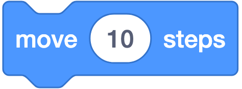
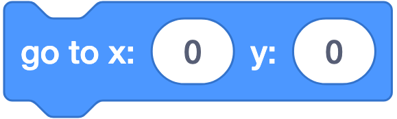
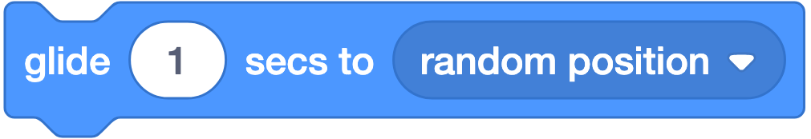
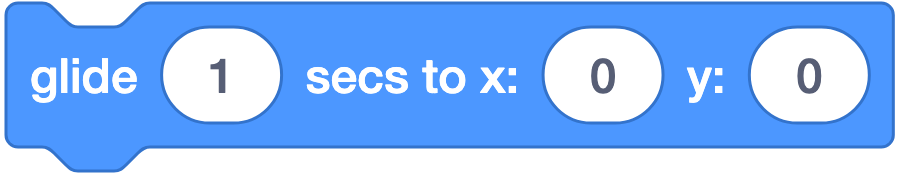
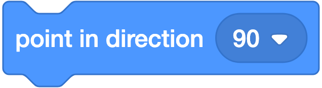
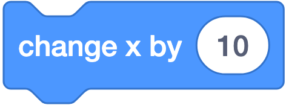
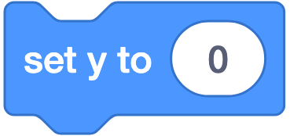
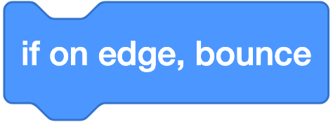
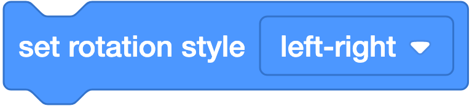
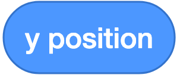

# 🔵 Motion (Gerak) — 18 Blok

**Warna:** Biru · **Fungsi umum:** menggerakkan dan menempatkan sprite
**⚠️ Hanya untuk Sprite.** Bila Stage dipilih, kategori ini **kosong** — panggung tidak bisa bergerak.

---

## Ringkasan Cepat

| Kelompok | Blok |
|---|---|
| **Gerak relatif** (dari posisi sekarang) | `move`, `turn ↻`, `turn ↺`, `change x by`, `change y by` |
| **Gerak absolut** (ke tempat tertentu) | `go to`, `go to x y`, `set x to`, `set y to`, `point in direction` |
| **Gerak halus** (berdurasi) | `glide to`, `glide to x y` |
| **Mengikuti target** | `point towards` |
| **Pengaturan** | `if on edge, bounce`, `set rotation style` |
| **Pelapor nilai** | `x position`, `y position`, `direction` |

**Bekal wajib:** panggung berukuran 480×360; **x: −240…240**, **y: −180…180**, pusat **(0,0)**.
**Arah:** 90 = kanan · 0 = atas · 180 = bawah · −90 = kiri.

---

## Penjelasan Tiap Blok

### 1. `move (10) steps`



**Artinya:** Maju ke depan sejauh 10 titik, mengikuti ke mana sprite sedang menghadap.
**Bentuk:** ▭ stack
**Fungsi:** Memajukan sprite **sesuai arah hadapnya** sejauh N piksel.
**Parameter:** `10` = jumlah piksel. Boleh negatif (mundur), boleh desimal.
**Contoh:**
```
when ⚑ clicked
move (100) steps
```
**Catatan:** "steps" = **piksel**, bukan langkah kaki. Arahnya mengikuti nilai *direction*, jadi kalau sprite menghadap 0 (atas), `move 100` membuatnya naik, bukan ke kanan. Ini blok paling sering disalahpahami siswa.

---

### 2. `turn ↻ (15) degrees`


**Artinya:** Memutar badan sprite ke kanan sebesar 15 derajat.
**Bentuk:** ▭ stack
**Fungsi:** Memutar sprite **searah jarum jam**.
**Parameter:** `15` = besar sudut. Nilai negatif memutar ke arah sebaliknya.
**Contoh:**
```
repeat (4)
  move (100) steps
  turn ↻ (90) degrees
```
→ menggambar lintasan persegi.
**Catatan:** `turn ↻ 360` mengembalikan sprite ke arah semula. Kombinasi `repeat (n)` + `turn ↻ (360/n)` adalah rumus dasar menggambar segi-n.

---

### 3. `turn ↺ (15) degrees`


**Artinya:** Memutar badan sprite ke kiri sebesar 15 derajat.
**Bentuk:** ▭ stack
**Fungsi:** Memutar sprite **berlawanan arah jarum jam**.
**Catatan:** Sama dengan blok no. 2 tetapi arah berlawanan. `turn ↺ 90` = `turn ↻ -90`.

---

### 4. `go to (random position ▾)`


**Artinya:** Pindah kedip ke tempat yang dipilih — langsung sampai, tanpa terlihat berjalan.
**Bentuk:** ▭ stack
**Fungsi:** Memindahkan sprite **seketika** (tanpa animasi) ke lokasi pilihan.
**Parameter (dropdown):**

| Pilihan | Arti |
|---|---|
| `random position` | Tempat acak di panggung |
| `mouse-pointer` | Posisi kursor mouse |
| *(nama sprite lain)* | Posisi sprite tersebut |

**Contoh:**
```
forever
  go to (mouse-pointer)
```
→ sprite mengikuti mouse.
**Catatan:** Perpindahan **instan**. Untuk gerak halus gunakan `glide`.

---

### 5. `go to x: (0) y: (0)`



**Artinya:** Pindah kedip ke titik koordinat tertentu di panggung.
**Bentuk:** ▭ stack
**Fungsi:** Memindahkan sprite seketika ke koordinat tertentu.
**Contoh:**
```
when ⚑ clicked
go to x: (0) y: (0)
```
**Catatan:** **Blok paling penting untuk script reset.** Selalu taruh di awal proyek agar sprite mulai dari posisi yang sama setiap kali dijalankan. Tanpa ini, sprite akan mulai dari posisi terakhir sesi sebelumnya.

---

### 6. `glide (1) secs to (random position ▾)`



**Artinya:** Meluncur pelan ke tempat pilihan selama 1 detik, gerakannya terlihat.
**Bentuk:** ▭ stack
**Fungsi:** Meluncur **halus** ke lokasi pilihan selama N detik.
**Parameter:** `1` = durasi (detik); dropdown sama dengan blok no. 4.
**Catatan:** Script **berhenti menunggu** sampai luncuran selesai (*blocking*). Jangan pakai di dalam `forever` bila ingin sprite tetap responsif terhadap tombol.

---

### 7. `glide (1) secs to x: (0) y: (0)`



**Artinya:** Meluncur pelan ke titik koordinat selama 1 detik.
**Bentuk:** ▭ stack
**Fungsi:** Meluncur halus ke koordinat tertentu.
**Contoh:**
```
when ⚑ clicked
go to x: (-200) y: (0)
glide (3) secs to x: (200) y: (0)
```
**Catatan:** Sangat cocok untuk animasi cerita. Kecepatan dihitung otomatis: jarak dibagi durasi.

---

### 8. `point in direction (90)`



**Artinya:** Mengatur sprite mau menghadap ke mana. 90 = kanan, 0 = atas.
**Bentuk:** ▭ stack
**Fungsi:** Menetapkan **arah hadap** sprite.
**Parameter:**

| Nilai | Arah |
|---|---|
| `90` | Kanan (default) |
| `0` | Atas |
| `180` | Bawah |
| `-90` | Kiri |

**Catatan:** Klik kolomnya → muncul **piringan pemutar** untuk memilih arah secara visual. Blok ini juga wajib ada di script reset.

---

### 9. `point towards (mouse-pointer ▾)`


**Artinya:** Memutar sprite supaya menghadap ke sasaran, misalnya kursor mouse.
**Bentuk:** ▭ stack
**Fungsi:** Menghadapkan sprite **ke arah** target.
**Parameter (dropdown):** `mouse-pointer`, `random direction`, atau nama sprite lain.
**Contoh — musuh mengejar pemain:**
```
forever
  point towards (Pemain)
  move (2) steps
```
**Catatan:** Kombinasi `point towards` + `move` adalah resep dasar **AI pengejar** dalam permainan.

---

### 10. `change x by (10)`



**Artinya:** Menggeser sprite 10 titik ke kanan. Selalu mendatar, tak peduli arah hadapnya.
**Bentuk:** ▭ stack
**Fungsi:** Menggeser sprite **mendatar** sejauh N piksel, **tanpa memedulikan arah hadap**.
**Contoh:**
```
when (right arrow ▾) key pressed
change x by (10)
```
**Catatan:** Berbeda dari `move` — blok ini **selalu** ke kanan (nilai positif) atau kiri (negatif), meski sprite menghadap ke atas. Inilah blok yang benar untuk kontrol tombol panah.

---

### 11. `set x to (0)`


**Artinya:** Menaruh sprite di posisi kiri-kanan tertentu; ketinggiannya tidak berubah.
**Bentuk:** ▭ stack
**Fungsi:** Menetapkan koordinat X, nilai Y tidak berubah.
**Contoh:** memindahkan sprite ke tepi kiri tanpa mengubah ketinggian:
```
set x to (-240)
```

---

### 12. `change y by (10)`


**Artinya:** Menggeser sprite 10 titik ke atas. Angka positif = naik, negatif = turun.
**Bentuk:** ▭ stack
**Fungsi:** Menggeser sprite **tegak** sejauh N piksel.
**Catatan:** Nilai **positif = naik**. Ini sering membingungkan siswa yang terbiasa koordinat layar komputer (di mana Y positif justru turun).
**Contoh — gravitasi sederhana:**
```
forever
  change y by (kecepatan)
  change (kecepatan) by (-1)
```

---

### 13. `set y to (0)`



**Artinya:** Menaruh sprite di ketinggian tertentu; posisi kiri-kanannya tidak berubah.
**Bentuk:** ▭ stack
**Fungsi:** Menetapkan koordinat Y, nilai X tidak berubah.
**Contoh:** mengembalikan tokoh ke permukaan tanah: `set y to (-100)`.

---

### 14. `if on edge, bounce`



**Artinya:** Kalau sprite kena pinggir panggung, ia langsung memantul balik.
**Bentuk:** ▭ stack
**Fungsi:** Bila sprite menyentuh tepi panggung, **arah hadapnya dibalik** sehingga memantul.
**Contoh — bola memantul tanpa henti:**
```
when ⚑ clicked
forever
  move (10) steps
  if on edge, bounce
```
**Catatan:** Hampir selalu dipasangkan dengan `set rotation style [left-right]`, kalau tidak sprite akan tampak jungkir balik saat memantul.

---

### 15. `set rotation style (left-right ▾)`



**Artinya:** Mengatur cara gambar sprite berubah saat ia berputar.
**Bentuk:** ▭ stack
**Fungsi:** Mengatur **bagaimana tampilan sprite berubah** saat arah hadapnya berubah.
**Parameter (dropdown):**

| Pilihan | Perilaku | Cocok untuk |
|---|---|---|
| `all around` | Gambar ikut berputar penuh | Roket, panah, jarum jam |
| `left-right` | Hanya cermin kiri/kanan, tidak pernah terbalik | **Tokoh berjalan** |
| `don't rotate` | Gambar tidak pernah berubah | Ikon, tombol |

**Catatan:** Ini **jawaban keluhan paling sering di kelas**: *"kucingnya jalan terbalik!"* → setel ke `left-right`. Blok ini mengubah **tampilan saja**; nilai `direction` tetap berubah seperti biasa.

---

### 16. `(x position)`


**Artinya:** Memberi tahu angka posisi kiri-kanan sprite saat ini.
**Bentuk:** ⬭ reporter
**Fungsi:** Melaporkan koordinat X sprite saat ini.
**Contoh:**
```
if <(x position) > (200)> then
  say [Aku di tepi kanan!]
```
**Catatan:** Ada **kotak centang ☐** di sebelahnya di palet — centang untuk menampilkan monitor nilai di panggung. Alat debugging terbaik untuk pemula.

---

### 17. `(y position)`



**Artinya:** Memberi tahu angka posisi atas-bawah sprite saat ini.
**Bentuk:** ⬭ reporter
**Fungsi:** Melaporkan koordinat Y sprite saat ini.
**Contoh — mendeteksi jatuh ke dasar:**
```
if <(y position) < (-170)> then
  say [Game Over]
```

---

### 18. `(direction)`


**Artinya:** Memberi tahu sprite sekarang menghadap ke arah berapa derajat.
**Bentuk:** ⬭ reporter
**Fungsi:** Melaporkan arah hadap sprite dalam derajat.
**Catatan:** Nilainya selalu berada dalam rentang **−179 sampai 180**. Jadi setelah `turn ↻ 200 degrees` dari arah 90, hasilnya dilaporkan sebagai −70, bukan 290.

---

## Ringkasan Perbandingan yang Sering Tertukar

| Pasangan | Beda utama |
|---|---|
| `move` vs `change x by` | `move` mengikuti **arah hadap**; `change x by` **selalu** mendatar |
| `go to x y` vs `glide to x y` | `go to` **instan**; `glide` **berdurasi & menunggu** |
| `change x by` vs `set x to` | `change` = **menambah** dari posisi sekarang; `set` = **menetapkan** nilai baru |
| `turn` vs `point in direction` | `turn` = memutar **relatif**; `point` = menetapkan arah **absolut** |
| `direction` vs `rotation style` | `direction` = arah **sesungguhnya**; `rotation style` = cara **menampilkannya** |

---

## Kesalahan Umum

| Kesalahan | Gejala | Perbaikan |
|---|---|---|
| Memakai `move` untuk kontrol tombol panah | Sprite bergerak menyerong / arah aneh | Ganti ke `change x by` / `change y by` |
| Lupa script reset | Posisi awal berbeda tiap kali dijalankan | Tambah `go to x: y:` + `point in direction (90)` di awal |
| `if on edge, bounce` tanpa `set rotation style` | Sprite jungkir balik | Tambah `set rotation style [left-right]` |
| Mengira "steps" = langkah | Salah memperkirakan jarak | Jelaskan 1 step = 1 piksel; panggung hanya 480 piksel lebar |
| `glide` di dalam `forever` untuk kontrol pemain | Kontrol terasa lambat/macet | Pakai `change x by` untuk kontrol; `glide` hanya untuk animasi |

---

## Latihan Bertingkat

| Level | Tantangan | Blok kunci |
|---|---|---|
| ⭐ | Buat kucing berjalan 100 langkah lalu berhenti | `move` |
| ⭐ | Buat kucing menggambar persegi | `repeat`, `move`, `turn` |
| ⭐⭐ | Kucing bergerak dengan 4 tombol panah | `change x by`, `change y by` |
| ⭐⭐ | Bola memantul tanpa henti dan tidak terbalik | `forever`, `if on edge bounce`, `set rotation style` |
| ⭐⭐⭐ | Musuh mengejar pemain | `point towards`, `move` |
| ⭐⭐⭐ | Sprite melompat lalu jatuh (gravitasi) | `change y by` + variabel kecepatan |

---

## Cek Pemahaman

1. Apa beda `move (10) steps` dengan `change x by (10)`?
2. Sprite menghadap arah `0`. Ke mana ia bergerak bila diberi `move (50) steps`?
3. Blok apa yang harus ditambahkan agar sprite tidak jungkir balik saat memantul?
4. Tuliskan script agar sprite selalu mengikuti kursor mouse.

<details>
<summary>Kunci jawaban</summary>

1. `move` bergerak mengikuti arah hadap sprite; `change x by` selalu mendatar tanpa memedulikan arah hadap.
2. Ke **atas**, karena arah 0 = atas.
3. `set rotation style [left-right]`.
4. ```
   when ⚑ clicked
   forever
     go to (mouse-pointer)
   ```
   (alternatif lebih halus: `point towards (mouse-pointer)` + `move (5) steps`)
</details>
