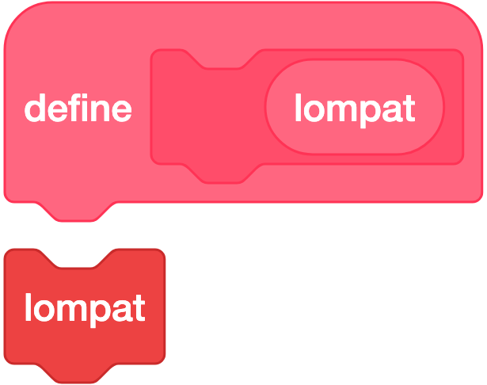
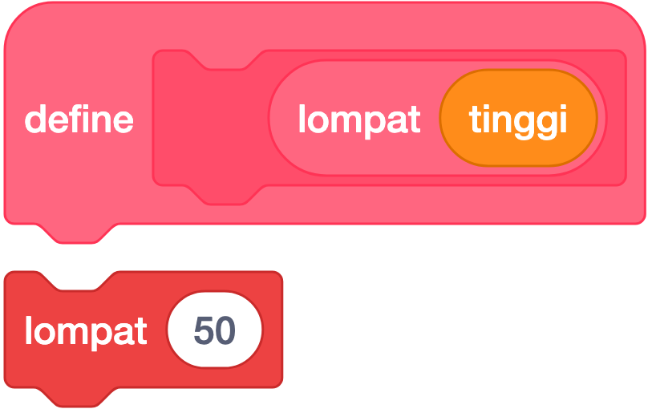
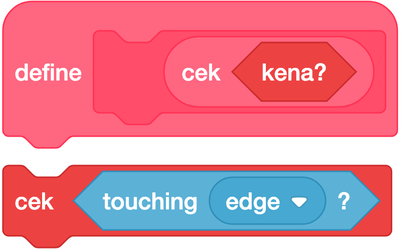
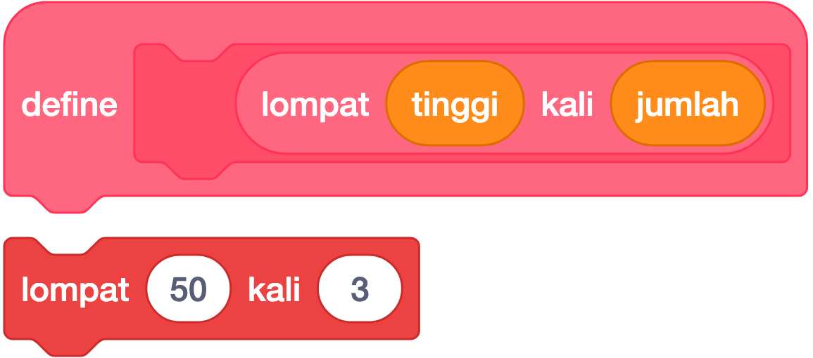
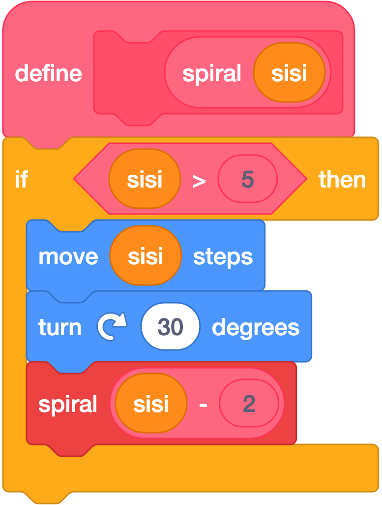

# 🩷 My Blocks (Blok Buatan Sendiri)

**Warna:** Merah muda tua · **Fungsi umum:** membuat **blok perintah sendiri** — setara dengan *fungsi/prosedur* di bahasa pemrograman lain
**Berlaku untuk:** Sprite dan Stage.
**Tingkat:** Lanjut — ajarkan setelah siswa menguasai loop, kondisi, dan variabel.

> Palet ini **kosong** saat pertama dibuka; hanya ada satu tombol: **Make a Block**.

---

## Mengapa My Blocks Penting?

Bandingkan dua script berikut. Keduanya menghasilkan hal yang sama:

**Tanpa My Blocks:**
```
move (100) steps
turn ↻ (90) degrees
move (100) steps
turn ↻ (90) degrees
move (100) steps
turn ↻ (90) degrees
move (100) steps
turn ↻ (90) degrees
```

**Dengan My Blocks:**
```
gambar persegi (100)
```

Blok buatan sendiri mengajarkan tiga konsep besar sekaligus:

| Konsep | Artinya |
|---|---|
| **Dekomposisi** | Memecah masalah besar jadi bagian-bagian kecil bernama |
| **Abstraksi** | Menyembunyikan detail rumit di balik satu nama sederhana |
| **DRY** (*Don't Repeat Yourself*) | Tidak menyalin kode yang sama berulang kali |

---

## Cara Membuat



**Artinya:** Kepala blok buatan sendiri. Semua blok di bawahnya jalan tiap blok itu dipanggil.

1. Klik **Make a Block** → muncul kotak dialog.
2. Ketik **nama blok**, misalnya `gambar persegi`.
3. Tambahkan input bila perlu (lihat di bawah).
4. Klik **OK**.

Hasilnya **dua hal** muncul sekaligus:
- Blok baru di **palet** (siap dipakai berkali-kali)
- Blok **`define ...`** di area kode — di bawah inilah isi perintahnya disusun

```
define gambar persegi
repeat (4)
  move (100) steps
  turn ↻ (90) degrees
```

> Blok `define` **tidak berjalan sendiri**. Ia hanya "resep". Yang berjalan adalah blok pemanggilnya.

---

## Tiga Jenis Input

Di kotak dialog **Make a Block** tersedia tiga tombol tambahan:

### 1. `Add an input — number or text`



**Artinya:** Menambah kolom isian supaya blok buatan bisa diberi angka atau teks yang berbeda-beda.
Membuat lubang isian yang bisa diisi angka atau teks.

```
define gambar persegi (sisi)
repeat (4)
  move (sisi) steps
  turn ↻ (90) degrees
```
Pemakaian: `gambar persegi (50)` atau `gambar persegi (200)` — satu blok, banyak ukuran.

**Catatan:** Nama input muncul sebagai blok reporter oval kecil di dalam `define`. Tarik dari situ untuk memakainya.

---

### 2. `Add an input — boolean`



**Artinya:** Menambah kolom heksagon supaya blok buatan bisa diberi syarat benar atau salah.
Membuat lubang segi enam yang menerima kondisi benar/salah.

```
define bergerak (jarak) jika (aman)
if <aman> then
  move (jarak) steps
```
Pemakaian: `bergerak (10) jika <not <touching (Musuh)?>>`

---

### 3. `Add a label text`



**Artinya:** Menambah tulisan penjelas di dalam blok supaya lebih mudah dibaca.
Menambahkan **teks hiasan** di dalam blok — tidak bisa diisi, hanya membuat blok lebih mudah dibaca.

Contoh: `gambar persegi (100) berwarna (merah)` — kata "berwarna" adalah label.

---

## Opsi `Run without screen refresh`

Kotak centang di bagian bawah dialog Make a Block.

| Keadaan | Perilaku |
|---|---|
| **Tidak dicentang** (default) | Layar diperbarui di setiap perulangan — gerakan terlihat berjalan |
| **Dicentang** | Seluruh isi blok dijalankan **dalam satu frame** — hasilnya muncul seketika |

**Kapan dicentang:**
- Menggambar bentuk rumit dengan ekstensi **Pen** (agar gambar muncul langsung, bukan dilukis perlahan)
- Perhitungan berat yang hasilnya saja yang penting

**⚠️ Peringatan penting:**
> **Jangan** dicentang bila blok memuat `wait` atau loop yang tidak pernah berakhir (`forever`). Proyek akan **membeku** sampai setengah detik atau lebih.

---

## Rekursi (Blok Memanggil Dirinya Sendiri)



**Artinya:** Blok buatan yang memanggil dirinya sendiri. Dipakai untuk pola berulang seperti spiral.

Blok buatan sendiri boleh memanggil dirinya sendiri. Ini disebut **rekursi**.

```
define hitung mundur (n)
if <(n) > (0)> then
  say (n) for (0.5) seconds
  hitung mundur ((n) - (1))
```
Pemanggilan `hitung mundur (5)` akan mengucapkan 5, 4, 3, 2, 1.

**Syarat mutlak:** harus ada **kondisi berhenti** (di contoh ini `if <(n) > (0)>`). Tanpa itu, blok memanggil dirinya tanpa akhir dan proyek akan macet.

**Contoh klasik — pohon fraktal** (dengan ekstensi Pen):
```
define cabang (panjang)
if <(panjang) > (5)> then
  move (panjang) steps
  turn ↻ (30) degrees
  cabang ((panjang) * (0.7))
  turn ↺ (60) degrees
  cabang ((panjang) * (0.7))
  turn ↻ (30) degrees
  move ((0) - (panjang)) steps
```

> Materi tingkat lanjut untuk SMP kelas atas — tetapi hasil visualnya sangat memukau dan layak dijadikan proyek pamungkas.

---

## Keterbatasan yang Perlu Diketahui

| Keterbatasan | Dampak | Jalan keluar |
|---|---|---|
| **Tidak ada custom reporter block** (⬭) | Blok buatan sendiri tidak bisa "mengembalikan nilai" | Simpan hasilnya ke **variabel**, lalu baca variabel itu |
| **Tidak ada custom boolean block** (⬡) | Tidak bisa membuat kondisi buatan sendiri | Gunakan variabel bernilai 0/1 |
| Blok bersifat **lokal per sprite** | Tidak otomatis tersedia di sprite lain | Salin lewat **duplicate sprite** atau **Backpack** |
| Tidak ada nilai bawaan untuk input | Kolom kosong dianggap kosong | Isi manual saat memanggil |

**Contoh jalan keluar untuk "mengembalikan nilai":**
```
define hitung luas (p) (l)
set (hasil) to ((p) * (l))
```
Pemakaian:
```
hitung luas (5) (3)
say (hasil)
```

---

## Contoh Penerapan di Kelas

### Contoh 1 — Menggambar segi banyak
```
define segi banyak (jumlah sisi) (panjang)
repeat (jumlah sisi)
  move (panjang) steps
  turn ↻ ((360) / (jumlah sisi)) degrees
```
Pemakaian: `segi banyak (3) (100)` = segitiga, `segi banyak (6) (60)` = segi enam.

### Contoh 2 — Merapikan proyek permainan
```
define reset semua
show
clear graphic effects
set size to (100) %
go to x: (0) y: (0)
point in direction (90)
set (skor) to (0)
set (nyawa) to (3)
```
Lalu setiap awal permainan cukup:
```
when ⚑ clicked
reset semua
```

### Contoh 3 — Menu berulang
```
define tampilkan pesan (teks) (lama)
switch costume to (bicara)
say (teks) for (lama) seconds
switch costume to (diam)
```

---

## Cara Mengajarkan (Urutan yang Berhasil)

1. **Mulai dari rasa lelah.** Minta siswa menyusun script menggambar 4 persegi berbeda ukuran — secara manual. Biarkan mereka merasakan repotnya.
2. **Tawarkan solusi.** Perkenalkan `Make a Block` sebagai "cara membuat perintah sendiri".
3. **Tanpa input dulu.** Buat `gambar persegi` yang ukurannya tetap.
4. **Baru tambahkan input.** `gambar persegi (sisi)` — tunjukkan satu blok bisa banyak ukuran.
5. **Terapkan ke proyek nyata.** Refactor permainan lama siswa memakai blok `reset semua`.
6. **Rekursi** hanya untuk siswa yang sudah siap.

---

## Kesalahan Umum

| Kesalahan | Gejala | Perbaikan |
|---|---|---|
| Menyusun kode di area kode biasa, bukan di bawah `define` | Blok buatan tidak melakukan apa-apa | Pastikan blok tersambung **di bawah `define`** |
| Mengira `define` berjalan sendiri | Tidak terjadi apa-apa | `define` hanya resep; panggil bloknya dari script lain |
| Mencentang *run without screen refresh* pada blok berisi `wait` | Proyek membeku | Hilangkan centang |
| Rekursi tanpa kondisi berhenti | Proyek macet/hang | Selalu beri `if` sebagai penghenti |
| Mengharap blok mengembalikan nilai | Bingung tidak ada hasilnya | Pakai variabel penampung |
| Mencari blok buatan di sprite lain | Tidak ada di palet | Duplicate sprite atau pakai Backpack |
| Nama blok terlalu umum (`blok1`) | Tidak terbaca | Beri nama kata kerja: `gambar persegi`, `reset semua` |

---

## Latihan Bertingkat

| Level | Tantangan | Kunci |
|---|---|---|
| ⭐⭐ | Buat blok `gambar persegi` tanpa input | `Make a Block`, `repeat` |
| ⭐⭐ | Tambahkan input `sisi` agar ukurannya bisa diatur | input number |
| ⭐⭐ | Buat blok `reset semua` dan pakai di proyek lama | dekomposisi |
| ⭐⭐⭐ | Buat blok `segi banyak (n) (panjang)` | input ganda + `360/n` |
| ⭐⭐⭐ | Buat blok `hitung luas` yang hasilnya disimpan ke variabel | jalan keluar reporter |
| ⭐⭐⭐⭐ | Buat pohon fraktal dengan rekursi | rekursi + ekstensi Pen |

---

## Cek Pemahaman

1. Apa fungsi blok `define`? Apakah ia berjalan sendiri?
2. Sebutkan tiga jenis input yang bisa ditambahkan ke blok buatan sendiri.
3. Kapan opsi *run without screen refresh* **tidak boleh** dicentang?
4. Scratch tidak punya custom reporter block. Bagaimana cara sebuah blok buatan "mengembalikan" hasil hitungan?
5. Apa syarat mutlak agar rekursi tidak membuat proyek macet?

<details>
<summary>Kunci jawaban</summary>

1. `define` menyimpan isi/resep blok buatan. Ia **tidak** berjalan sendiri — baru dijalankan saat blok pemanggilnya dipakai di script lain.
2. Input **number or text**, input **boolean**, dan **label text** (teks hiasan, bukan input sesungguhnya).
3. Bila di dalam blok terdapat blok `wait` atau loop tak berujung seperti `forever` — proyek akan membeku.
4. Simpan hasilnya ke sebuah **variabel**, lalu baca variabel tersebut setelah blok dipanggil.
5. Harus ada **kondisi berhenti** (biasanya `if`) yang membuat pemanggilan berhenti pada suatu titik.
</details>
