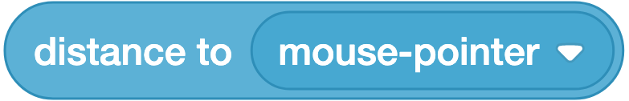
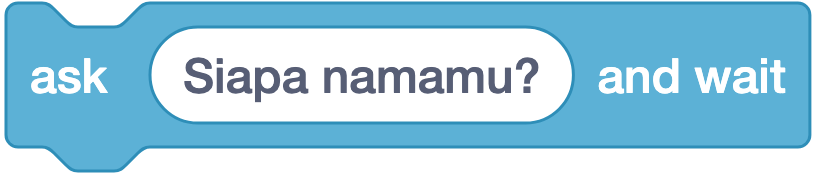
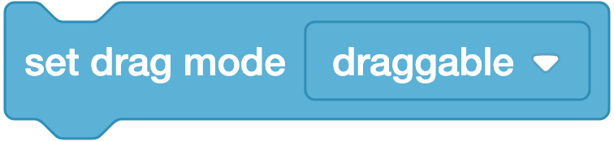
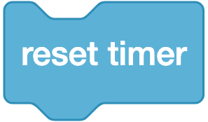
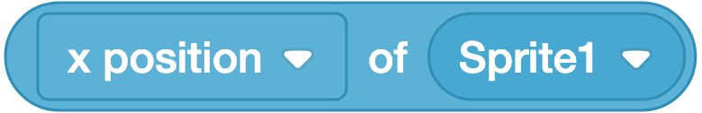

# 🩵 Sensing (Sensor) — 18 Blok

**Warna:** Biru muda · **Fungsi umum:** membuat proyek **merasakan** apa yang terjadi — tabrakan, tombol, mouse, mikrofon, waktu, dan jawaban pemain
**Berlaku untuk:** Sprite dan Stage (sebagian blok tidak berguna di Stage karena panggung tidak bisa bergerak).

> Kategori ini yang membuat proyek berubah dari **animasi** menjadi **interaktif**. Hampir semua blok di sini dipasangkan dengan `if` dari kategori Control.

---

## Ringkasan Cepat

| Kelompok | Blok | Bentuk |
|---|---|---|
| **Deteksi tabrakan** | `touching ()?`, `touching color ()?`, `color () is touching ()?`, `distance to ()` | ⬡ / ⬭ |
| **Input pemain** | `ask and wait`, `(answer)`, `key () pressed?`, `mouse down?`, `mouse x`, `mouse y`, `set drag mode` | ▭ / ⬡ / ⬭ |
| **Sensor perangkat** | `(loudness)` | ⬭ |
| **Waktu** | `(timer)`, `reset timer`, `current ()`, `days since 2000` | ⬭ / ▭ |
| **Data objek lain** | `([] of ())`, `(username)` | ⬭ |

---

## A. Deteksi Tabrakan & Jarak

### 1. `<touching (mouse-pointer ▾)?>`


**Artinya:** Bertanya: apakah sprite sedang bersentuhan dengan sasaran itu? Jawabannya benar atau salah.
**Bentuk:** ⬡ boolean
**Fungsi:** Bernilai **benar** bila sprite sedang menyentuh target.
**Parameter (dropdown):** `mouse-pointer`, `edge` (tepi panggung), atau nama sprite lain.
**Contoh:**
```
forever
  if <touching (Musuh)?> then
    change (nyawa) by (-1)
    wait (1) seconds
```
**Catatan:**
- Sprite yang sedang `hide` **tidak terdeteksi**. Bila butuh area tabrakan tak kasatmata, pakai `set (ghost) effect to (100)` sebagai ganti `hide`.
- Deteksi berdasarkan **piksel gambar yang tidak transparan**, bukan kotak pembatas — cukup akurat.
- Beri `wait` setelah pengurangan nyawa, kalau tidak nyawa akan berkurang puluhan kali dalam sekejap.

---

### 2. `<touching color [■]?>`


**Artinya:** Bertanya: apakah sprite sedang menyentuh warna tertentu?
**Bentuk:** ⬡ boolean
**Fungsi:** Bernilai benar bila sprite menyentuh **warna tertentu** apa pun di panggung.
**Parameter:** kotak warna — klik lalu gunakan **pipet (eyedropper)** untuk mengambil warna langsung dari panggung.
**Contoh — permainan labirin:**
```
forever
  if <touching color [hitam]?> then
    go to x: (0) y: (0)
```
**Catatan:** Warna harus **persis sama**. Gunakan pipet, jangan menebak dari roda warna — ini penyebab tersering blok ini "tidak berfungsi".

---

### 3. `<color [■] is touching [■]?>`


**Artinya:** Bertanya: apakah bagian berwarna tertentu pada sprite menyentuh warna lain?
**Bentuk:** ⬡ boolean
**Fungsi:** Bernilai benar bila **warna tertentu pada sprite ini** menyentuh **warna tertentu di panggung**.
**Contoh:** hanya bagian kaki tokoh (warna merah) yang menyentuh tanah (warna hijau) — dipakai untuk deteksi pijakan pada game platformer.
**Catatan:** Versi lebih presisi dari blok no. 2. Materi tingkat lanjut.

---

### 4. `(distance to (mouse-pointer ▾))`



**Artinya:** Memberi tahu jarak sprite ke sasaran dalam satuan titik.
**Bentuk:** ⬭ reporter
**Fungsi:** Melaporkan jarak (piksel) dari sprite ini ke target.
**Parameter (dropdown):** `mouse-pointer` atau nama sprite lain (**tidak** ada pilihan `edge`).
**Contoh — permainan "panas–dingin":**
```
forever
  if <(distance to (Harta)) < (50)> then
    say [Panas!]
  else
    say [Dingin...]
```
**Catatan:** Alternatif deteksi tabrakan yang lebih halus — bisa mendeteksi "hampir kena" sebelum benar-benar bersentuhan.

---

## B. Input Pemain

### 5. `ask [Siapa namamu?] and wait`



**Artinya:** Memunculkan kotak pertanyaan lalu menunggu pemain mengetik jawabannya.
**Bentuk:** ▭ stack
**Fungsi:** Menampilkan kotak isian di bawah panggung dan **menunggu** pemain mengetik lalu menekan Enter.
**Contoh:**
```
ask [Siapa namamu?] and wait
say (join [Halo, ] (answer)) for (2) seconds
```
**Catatan:** Bila dijalankan oleh sprite yang terlihat, pertanyaannya muncul dalam balon bicara; bila oleh Stage atau sprite tersembunyi, muncul sebagai teks biasa di atas kotak isian.

---

### 6. `(answer)`


**Artinya:** Menyimpan jawaban terakhir yang diketik pemain.
**Bentuk:** ⬭ reporter
**Fungsi:** Melaporkan **jawaban terakhir** yang diketik pemain.
**Catatan penting:** `answer` bersifat **global** — nilainya sama untuk semua sprite, dan akan **tertimpa** oleh `ask` berikutnya. Bila jawaban perlu disimpan, salin segera ke variabel:
```
ask [Siapa namamu?] and wait
set (nama) to (answer)
```

---

### 7. `<key (space ▾) pressed?>`


**Artinya:** Bertanya: apakah tombol itu sedang ditekan sekarang?
**Bentuk:** ⬡ boolean
**Fungsi:** Bernilai benar **selama** tombol ditekan.
**Parameter (dropdown):** tombol panah, huruf, angka, `space`, dan `any`.
**Contoh — kontrol permainan yang mulus:**
```
when ⚑ clicked
forever
  if <key (right arrow) pressed?> then
    change x by (10)
  if <key (left arrow) pressed?> then
    change x by (-10)
```
**Catatan:** **Inilah cara yang benar** untuk kontrol permainan — tanpa jeda tersendat seperti pada blok Events `when () key pressed`. Bandingkan keduanya di kelas; perbedaannya sangat terasa.

---

### 8. `<mouse down?>`


**Artinya:** Bertanya: apakah tombol mouse sedang ditekan?
**Bentuk:** ⬡ boolean
**Fungsi:** Bernilai benar selama tombol mouse ditekan.
**Contoh — menggambar dengan mouse (butuh ekstensi Pen):**
```
forever
  go to (mouse-pointer)
  if <mouse down?> then
    pen down
  else
    pen up
```

---

### 9. `(mouse x)`


**Artinya:** Memberi tahu posisi kiri-kanan kursor mouse.
**Bentuk:** ⬭ reporter
**Fungsi:** Melaporkan koordinat X kursor mouse (−240 … 240).

---

### 10. `(mouse y)`


**Artinya:** Memberi tahu posisi atas-bawah kursor mouse.
**Bentuk:** ⬭ reporter
**Fungsi:** Melaporkan koordinat Y kursor mouse (−180 … 180).
**Contoh — papan pemantul (game Pong):**
```
forever
  set x to (mouse x)
```
→ papan mengikuti mouse hanya secara mendatar.

---

### 11. `set drag mode (draggable ▾)`



**Artinya:** Mengatur boleh tidaknya sprite digeser pakai mouse saat proyek berjalan.
**Bentuk:** ▭ stack
**Fungsi:** Menentukan apakah pemain boleh **menyeret** sprite dengan mouse **saat proyek berjalan penuh layar**.
**Parameter:** `draggable` (boleh) / `not draggable` (tidak boleh).
**Catatan:** Di dalam editor, sprite selalu bisa diseret. Pengaturan ini baru terasa pada mode layar penuh / halaman proyek. Berguna untuk permainan puzzle susun gambar.

---

## C. Sensor Perangkat

### 12. `(loudness)`


**Artinya:** Memberi tahu seberapa keras suara di sekitar, ditangkap lewat mikrofon.
**Bentuk:** ⬭ reporter
**Fungsi:** Melaporkan tingkat kekerasan suara dari **mikrofon** (0–100).
**Contoh — balon mengembang saat ditiup:**
```
forever
  set size to ((loudness) + (50)) %
```
**Catatan:** Perlu **izin mikrofon** dari browser. Sangat memikat siswa. Nilai di ruang kelas yang ramai biasanya 10–30, tepuk tangan bisa 60+.

---

## D. Waktu

### 13. `(timer)`


**Artinya:** Memberi tahu sudah berapa detik berjalan sejak penghitung waktu terakhir dinolkan.
**Bentuk:** ⬭ reporter
**Fungsi:** Melaporkan waktu yang berjalan (dalam detik, dengan desimal).
**Catatan:** Timer **selalu berjalan** sejak proyek dimuat, dan **tidak** otomatis berhenti atau ter-reset saat bendera hijau diklik. Karena itu hampir selalu dipasangkan dengan blok berikutnya.

---

### 14. `reset timer`



**Artinya:** Mengembalikan penghitung waktu ke nol.
**Bentuk:** ▭ stack
**Fungsi:** Mengembalikan timer ke 0.
**Contoh — permainan berbatas waktu:**
```
when ⚑ clicked
reset timer
repeat until <(timer) > (30)>
  change (skor) by (1)
say [Waktu habis!]
```

---

### 15. `(current (year ▾))`


**Artinya:** Mengambil waktu sekarang dari jam komputer: tahun, bulan, jam, dan seterusnya.
**Bentuk:** ⬭ reporter
**Fungsi:** Melaporkan data waktu **nyata** dari komputer pemain.
**Parameter (dropdown):** `year`, `month`, `date`, `day of week`, `hour`, `minute`, `second`.
**Contoh — sapaan sesuai waktu:**
```
if <(current (hour)) < (12)> then
  say [Selamat pagi!]
else
  say [Selamat sore!]
```
**Catatan:** `day of week` bernilai 1 untuk Minggu sampai 7 untuk Sabtu. Jam memakai format 24 jam.

---

### 16. `(days since 2000)`


**Artinya:** Memberi tahu sudah berapa hari sejak 1 Januari 2000. Sering dipakai membuat angka acak.
**Bentuk:** ⬭ reporter
**Fungsi:** Melaporkan jumlah hari sejak 1 Januari 2000, dalam bentuk desimal.
**Catatan:** Dipakai untuk **menghitung selisih waktu** yang panjang, misalnya "sudah berapa hari sejak terakhir bermain". Materi lanjutan.

---

## E. Data Objek Lain

### 17. `([backdrop # ▾] of (Stage ▾))`



**Artinya:** Mengintip nilai milik sprite lain, misalnya posisi atau ukurannya.
**Bentuk:** ⬭ reporter
**Fungsi:** Membaca **properti sprite atau Stage lain**.
**Parameter:** dropdown kedua memilih objek; dropdown pertama memilih properti yang bisa dibaca dari objek itu.

| Bila objeknya **Sprite** | Bila objeknya **Stage** |
|---|---|
| `x position`, `y position`, `direction`, `costume #`, `costume name`, `size`, `volume` | `backdrop #`, `backdrop name`, `volume` |
| + semua **variabel lokal** sprite itu | + semua **variabel global** |

**Contoh — musuh membayangi pemain secara mendatar:**
```
forever
  set x to ([x position] of (Pemain))
```
**Catatan:** Ini satu-satunya cara sprite "mengintip" data sprite lain. Sangat berguna untuk AI musuh dan kamera pengikut.

---

### 18. `(username)`


**Artinya:** Memberi tahu nama akun Scratch pemain, bila proyek dibuka di situs Scratch.
**Bentuk:** ⬭ reporter
**Fungsi:** Melaporkan **nama pengguna Scratch** pemain yang sedang membuka proyek.
**Contoh:**
```
say (join [Halo, ] (username)) for (2) seconds
```
**Catatan:** Kosong bila pemain belum login atau proyek dijalankan di editor offline. Sering dipakai untuk papan skor bersama cloud variable.

> Selain 18 blok di atas, terdapat blok tersembunyi `<online?>` yang **tidak muncul di palet standar**.

---

## Pola-Pola Penting

### Pola 1 — Kontrol pemain (WAJIB dikuasai)
```
when ⚑ clicked
forever
  if <key (right arrow) pressed?> then
    change x by (10)
  if <key (left arrow) pressed?> then
    change x by (-10)
  if <key (up arrow) pressed?> then
    change y by (10)
  if <key (down arrow) pressed?> then
    change y by (-10)
```

### Pola 2 — Deteksi tabrakan dengan jeda aman
```
forever
  if <touching (Musuh)?> then
    change (nyawa) by (-1)
    start sound (Aduh)
    wait (1) seconds
```

### Pola 3 — Kuis dengan jawaban tersimpan
```
ask [Berapa 7 x 8?] and wait
if <(answer) = (56)> then
  change (skor) by (10)
```

---

## Kesalahan Umum

| Kesalahan | Gejala | Perbaikan |
|---|---|---|
| Blok Sensing tidak dibungkus `forever` | Hanya terdeteksi sekali | Bungkus dengan `forever` |
| Nyawa berkurang drastis saat bersentuhan | Berkurang tiap frame | Tambah `wait (1) seconds` setelahnya |
| `touching color` diisi dengan menebak warna | Tidak pernah terdeteksi | Gunakan **pipet** untuk mengambil warna asli |
| `touching ()?` pada sprite yang di-`hide` | Tidak terdeteksi | Gunakan efek ghost 100 sebagai gantinya |
| Lupa `reset timer` | Waktu sudah berjalan sebelum permainan mulai | Tambah `reset timer` setelah `when ⚑ clicked` |
| `answer` dipakai jauh setelah `ask` | Nilainya sudah tertimpa | Simpan segera ke variabel |
| Mengharap `set drag mode` bekerja di editor | Tidak terlihat bedanya | Uji di mode layar penuh |
| Mikrofon tidak diizinkan | `loudness` selalu 0 | Izinkan akses mikrofon di browser |

---

## Latihan Bertingkat

| Level | Tantangan | Blok kunci |
|---|---|---|
| ⭐ | Kucing menyapa dengan nama pemain | `ask and wait`, `answer`, `join` |
| ⭐ | Sprite mengikuti mouse | `mouse x`, `mouse y` |
| ⭐⭐ | Kontrol 4 arah dengan tombol panah | `key () pressed?`, `forever`, `if` |
| ⭐⭐ | Permainan tangkap koin dengan skor | `touching ()?`, variabel |
| ⭐⭐ | Balon membesar saat ditiup | `loudness` |
| ⭐⭐⭐ | Labirin: menyentuh dinding = kembali ke awal | `touching color ()?` |
| ⭐⭐⭐ | Musuh mengikuti posisi pemain | `([x position] of (Pemain))` |

---

## Cek Pemahaman

1. Mengapa `<key () pressed?>` lebih baik daripada `when () key pressed` untuk kontrol permainan?
2. Apa yang terjadi pada nilai `(answer)` setelah blok `ask` dijalankan lagi?
3. Sprite tersembunyi (`hide`) tidak terdeteksi `touching ()?`. Apa alternatifnya?
4. Blok apa yang dipakai agar sprite bisa membaca posisi X sprite lain?
5. Mengapa `reset timer` hampir selalu dibutuhkan?

<details>
<summary>Kunci jawaban</summary>

1. Karena `<key () pressed?>` di dalam `forever` tidak punya jeda ulang, sehingga gerakan mulus; blok Events tersendat saat tombol ditahan.
2. Nilainya **tertimpa** oleh jawaban baru. Simpan ke variabel bila masih dibutuhkan.
3. Gunakan `set (ghost) effect to (100)` — sprite tak terlihat tetapi tetap terdeteksi.
4. `([x position] of (nama sprite))`.
5. Karena timer berjalan sejak proyek dimuat dan tidak otomatis nol saat bendera hijau diklik.
</details>
