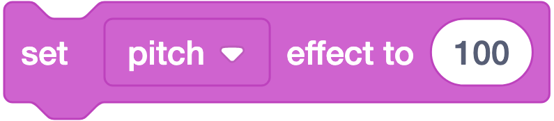
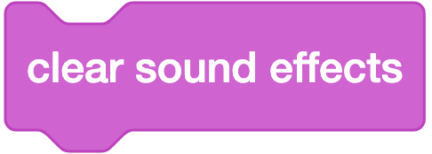
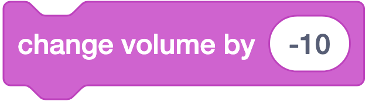
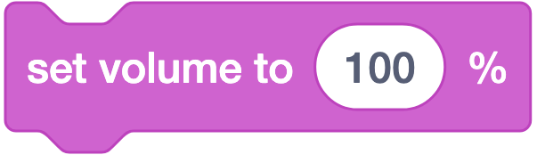

# 🩷 Sound (Suara) — 9 Blok

**Warna:** Merah muda · **Fungsi umum:** memainkan dan mengatur suara
**Berlaku untuk:** Sprite **dan** Stage (Stage bisa memainkan musik latar).

**Prasyarat:** suara harus sudah ada di **tab Sounds** milik sprite/Stage tersebut. Cara menambah: pustaka Scratch, **rekam sendiri lewat mikrofon**, atau unggah berkas.

---

## Ringkasan Cepat

| Kelompok | Blok |
|---|---|
| **Memainkan** | `play sound until done`, `start sound`, `stop all sounds` |
| **Efek suara** | `change effect by`, `set effect to`, `clear sound effects` |
| **Volume** | `change volume by`, `set volume to`, `(volume)` |

---

## Penjelasan Tiap Blok

### 1. `play sound (Meow ▾) until done`


**Artinya:** Memainkan suara sampai habis dulu, baru blok berikutnya jalan.
**Bentuk:** ▭ stack
**Fungsi:** Memainkan suara dan **menunggu sampai suara habis** sebelum melanjutkan ke blok berikutnya.
**Parameter (dropdown):** daftar suara milik sprite tersebut.
**Contoh — dialog berurutan rapi:**
```
when ⚑ clicked
play sound (Halo) until done
play sound (ApaKabar) until done
```
→ suara kedua baru berbunyi setelah yang pertama selesai.
**Catatan:** Sifatnya *blocking*. Ini blok yang tepat untuk **narasi cerita** agar suara tidak saling menimpa.

---

### 2. `start sound (Meow ▾)`


**Artinya:** Menyalakan suara lalu langsung lanjut ke blok berikutnya, tanpa menunggu.
**Bentuk:** ▭ stack
**Fungsi:** Memainkan suara **tanpa menunggu** — script langsung lanjut ke blok berikutnya.
**Contoh — efek suara saat melompat:**
```
when (space ▾) key pressed
start sound (Pop)
change y by (50)
```
→ suara dan gerakan terjadi **bersamaan**.
**Catatan:** Blok yang tepat untuk **efek suara dalam permainan** (tembakan, lompat, koin). Bila dipanggil berulang cepat, suara akan bertumpuk.

> 🔑 **Beda `play sound until done` vs `start sound` adalah konsep penting:**
> tunggu (*blocking*) vs jalan terus (*non-blocking*). Ini bekal memahami `await`/async di pemrograman lanjutan.

---

### 3. `stop all sounds`


**Artinya:** Menghentikan seketika semua suara yang sedang berbunyi.
**Bentuk:** ▭ stack
**Fungsi:** Menghentikan **seluruh** suara yang sedang berbunyi, dari semua sprite sekaligus.
**Contoh:**
```
when I receive (game over)
stop all sounds
play sound (Kalah) until done
```
**Catatan:** Wajib ada saat berganti level/scene agar musik latar lama tidak menumpuk dengan yang baru.

---

### 4. `change (pitch ▾) effect by (10)`


**Artinya:** Menambah efek suara, misalnya nada makin tinggi seperti suara tupai.
**Bentuk:** ▭ stack
**Fungsi:** Menambah nilai efek suara.
**Parameter (dropdown):**

| Efek | Rentang praktis | Hasil |
|---|---|---|
| `pitch` | −360 … 360 | Nada naik (nilai +) atau turun (nilai −) |
| `pan left/right` | −100 … 100 | −100 = hanya speaker kiri, 0 = tengah, 100 = kanan |

**Contoh — suara makin tinggi tiap dapat koin:**
```
change (pitch) effect by (20)
start sound (Koin)
```
**Catatan:** `pitch` mengubah **nada sekaligus kecepatan** suara, mirip memutar kaset lebih cepat. Efek `pan` butuh headphone/speaker stereo agar terasa.

---

### 5. `set (pitch ▾) effect to (100)`



**Artinya:** Menetapkan langsung nilai efek suara. Nilai 0 berarti suara normal.
**Bentuk:** ▭ stack
**Fungsi:** Menetapkan nilai efek suara secara pasti.
**Contoh — suara tokoh raksasa:**
```
set (pitch) effect to (-200)
play sound (Halo) until done
```
**Catatan:** Nilai `0` = suara normal.

---

### 6. `clear sound effects`



**Artinya:** Menghapus semua efek suara supaya kembali normal.
**Bentuk:** ▭ stack
**Fungsi:** Menghapus semua efek suara (pitch & pan) sekaligus.
**Catatan:** Masukkan ke script reset, karena efek suara **bertahan** meski proyek dihentikan.

---

### 7. `change volume by (-10)`



**Artinya:** Mengurangi keras suara 10 persen dari yang sekarang.
**Bentuk:** ▭ stack
**Fungsi:** Menambah/mengurangi volume sprite ini sebanyak N persen.
**Contoh — musik memudar (fade out):**
```
repeat (10)
  change volume by (-10)
  wait (0.1) seconds
stop all sounds
```

---

### 8. `set volume to (100) %`



**Artinya:** Menetapkan keras suara. 100% = paling keras, 0% = diam.
**Bentuk:** ▭ stack
**Fungsi:** Menetapkan volume dalam persen (0 = diam, 100 = penuh).
**Catatan penting:** Volume bersifat **per sprite**. Menyetel volume di Sprite1 tidak memengaruhi Sprite2. Untuk musik latar, atur volume di **Stage**.

---

### 9. `(volume)`


**Artinya:** Memberi tahu keras suara sprite ini sekarang berapa persen.
**Bentuk:** ⬭ reporter
**Fungsi:** Melaporkan volume sprite ini saat ini (0–100).
**Contoh — tombol volume:**
```
if <(volume) > (0)> then
  change volume by (-10)
```
**Catatan:** Ada kotak centang ☐ di palet untuk menampilkan monitornya di panggung.

---

## Pola Pemakaian yang Sering Dipakai

### Musik latar berulang (taruh di **Stage**)
```
when ⚑ clicked
set volume to (60) %
forever
  play sound (Musik) until done
```
> Pakai `until done` di dalam `forever` agar musik berulang mulus tanpa tumpang tindih.

### Efek suara permainan (taruh di **Sprite**)
```
when this sprite clicked
start sound (Pop)
change (skor) by (1)
```

### Script reset suara
```
when ⚑ clicked
stop all sounds
clear sound effects
set volume to (100) %
```

---

## Kesalahan Umum

| Kesalahan | Gejala | Perbaikan |
|---|---|---|
| Memakai `start sound` di dalam `forever` untuk musik latar | Suara bertumpuk jadi berisik/kacau | Ganti ke `play sound until done` |
| Memakai `play sound until done` untuk efek lompat | Gerakan tertunda menunggu suara | Ganti ke `start sound` |
| Efek pitch tertinggal dari percobaan | Semua suara terdengar aneh | Tambah `clear sound effects` di reset |
| Suara ditaruh di sprite yang salah | Dropdown tidak memuat suara yang dicari | Cek tab Sounds pada sprite yang benar |
| Rekaman terlalu panjang | Proyek berat (batas 10 MB per aset) | Potong di Sound Editor, maksimal beberapa detik |
| Mengira `set volume` berlaku global | Sebagian sprite tetap keras | Atur volume di tiap sprite, atau pusatkan musik di Stage |

---

## Latihan Bertingkat

| Level | Tantangan | Blok kunci |
|---|---|---|
| ⭐ | Kucing mengeong saat diklik | `when this sprite clicked`, `start sound` |
| ⭐ | Rekam suaramu sendiri lalu mainkan | tab Sounds → Record, `play sound until done` |
| ⭐⭐ | Musik latar berulang tanpa putus | `forever` + `play sound until done` |
| ⭐⭐ | Musik memudar saat permainan berakhir | `change volume by`, `repeat` |
| ⭐⭐⭐ | Nada naik tiap kali dapat poin | `change pitch effect by`, variabel |

---

## Cek Pemahaman

1. Kamu ingin efek suara lompat berbunyi **bersamaan** dengan gerakan. Blok mana yang dipakai?
2. Mengapa musik latar dalam `forever` sebaiknya memakai `play sound until done`?
3. Apakah `set volume to (50)%` di Sprite1 memengaruhi volume Sprite2?
4. Blok apa yang mengembalikan suara ke kondisi normal setelah dipakai efek pitch?

<details>
<summary>Kunci jawaban</summary>

1. `start sound` (non-blocking).
2. Agar lagu selesai dulu baru diulang; dengan `start sound` lagu akan ditumpuk berkali-kali sehingga berisik.
3. Tidak. Volume bersifat per sprite.
4. `clear sound effects` (atau `set (pitch) effect to (0)`).
</details>
