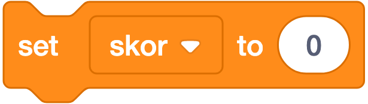

# 🟧 Variables (Variabel & List) — 5 + 12 Blok

**Warna:** Oranye tua (variabel) & Merah tua (list) · **Fungsi umum:** menyimpan dan mengolah data
**Berlaku untuk:** Sprite dan Stage.

> Kategori ini berbeda dari yang lain: **bloknya belum ada sampai kamu membuatnya sendiri**. Palet hanya menampilkan dua tombol: **Make a Variable** dan **Make a List**.

---

## Bagian 1 — VARIABEL

### Apa itu Variabel?

**Variabel** adalah **wadah bernama untuk menyimpan satu nilai** (angka atau teks) yang bisa berubah selama program berjalan.

**Analogi:** variabel itu seperti **kotak berlabel**. Label = nama (`skor`), isi = nilai (`25`). Isinya bisa diganti kapan saja, tapi labelnya tetap.

**Contoh pemakaian:** skor, nyawa, kecepatan, nama pemain, waktu tersisa, level.

---

### Membuat Variabel

Klik **Make a Variable** → muncul kotak dialog:

| Pilihan | Arti | Kapan dipakai |
|---|---|---|
| **For all sprites** (global) | Semua sprite & Stage bisa membaca dan mengubahnya | Skor, level, nyawa — data bersama |
| **For this sprite only** (lokal) | Hanya milik sprite ini; **setiap klon punya salinan sendiri** | Kecepatan tiap peluru, HP tiap musuh |
| **Cloud variable ☁** | Disimpan di server Scratch, dibagi ke semua pemain | Papan skor tertinggi |

> ☁ **Cloud variable** hanya bisa berisi **angka**, maksimal **10 per proyek**, dan **tidak tersedia** bagi *New Scratcher* maupun di editor offline.

---

### Penjelasan 5 Blok Variabel

#### 1. `(nama variabel)`


**Artinya:** Kotak penyimpan satu nilai. Isinya bisa dipakai di blok mana saja.
**Bentuk:** ⬭ reporter
**Fungsi:** Melaporkan nilai yang tersimpan.
**Contoh:** `say (join [Skor: ] (skor))`
**Catatan:** Ada **kotak centang ☐** di sebelahnya. Dicentang → muncul **monitor** di panggung. Klik kanan monitor untuk memilih tampilan: normal, besar, atau **slider** (penggeser yang bisa diatur pemain).

---

#### 2. `set (skor ▾) to (0)`



**Artinya:** Mengisi variabel dengan nilai baru, menimpa isi lamanya.
**Bentuk:** ▭ stack
**Fungsi:** **Mengisi** variabel dengan nilai baru, menimpa isi lama.
**Contoh:**
```
when ⚑ clicked
set (skor) to (0)
set (nyawa) to (3)
```
**Catatan:** **Wajib ada di script reset.** Tanpa ini, skor akan melanjutkan dari permainan sebelumnya. Ini kesalahan nomor satu pada proyek permainan buatan siswa.

---

#### 3. `change (skor ▾) by (1)`


**Artinya:** Menambah isi variabel sebanyak 1 dari nilai sekarang.
**Bentuk:** ▭ stack
**Fungsi:** **Menambah** nilai variabel (nilai negatif = mengurangi).
**Contoh:**
```
when this sprite clicked
change (skor) by (10)
change (nyawa) by (-1)
```
**Catatan:** Hanya bekerja untuk **angka**. Bila variabel berisi teks, hasilnya menjadi tidak terduga.

> 🔑 **Beda `set` vs `change` adalah konsep penting:**
> `set (skor) to (1)` → skor menjadi **tepat 1**
> `change (skor) by (1)` → skor **bertambah 1** dari nilai sekarang

---

#### 4. `show variable (skor ▾)`


**Artinya:** Menampilkan kotak nilai variabel di panggung supaya pemain bisa melihatnya.
**Bentuk:** ▭ stack
**Fungsi:** Menampilkan monitor variabel di panggung lewat program.
**Contoh:** menampilkan skor hanya saat permainan berlangsung.

---

#### 5. `hide variable (skor ▾)`


**Artinya:** Menyembunyikan kotak nilai variabel dari panggung.
**Bentuk:** ▭ stack
**Fungsi:** Menyembunyikan monitor variabel.
**Contoh:**
```
when I receive (game over)
hide variable (waktu)
```

---

## Bagian 2 — LIST (Daftar)

### Apa itu List?

**List** adalah **variabel yang bisa menyimpan banyak nilai sekaligus**, tersusun berurutan dan bernomor mulai dari **1**.

**Analogi:** kalau variabel adalah **satu kotak**, list adalah **rak berisi banyak kotak bernomor**.

| | Variabel | List |
|---|---|---|
| Isi | 1 nilai | Banyak nilai |
| Contoh | `skor = 25` | `nama = [Andi, Budi, Cici]` |
| Dipakai untuk | Skor, nyawa | Bank soal, papan skor, inventaris, riwayat |

**Batas:** tidak bisa menambah item bila list sudah memuat **200.000 item**.

---

### Penjelasan 12 Blok List

#### 6. `(nama list)`


**Artinya:** List adalah kotak penyimpan yang memuat BANYAK nilai sekaligus, bernomor urut.
**Bentuk:** ⬭ reporter
**Fungsi:** Melaporkan **seluruh isi** list, disambung dengan spasi.
**Catatan:** Jarang dipakai langsung dalam perhitungan; lebih sering dipakai monitornya di panggung.

---

#### 7. `add [thing] to (daftar ▾)`


**Artinya:** Menambah satu isi baru di urutan paling belakang list.
**Bentuk:** ▭ stack
**Fungsi:** Menambahkan item baru **di akhir** list.
**Contoh:**
```
ask [Siapa namamu?] and wait
add (answer) to (daftar pemain)
```

---

#### 8. `delete (1) of (daftar ▾)`


**Artinya:** Menghapus isi list pada urutan tertentu.
**Bentuk:** ▭ stack
**Fungsi:** Menghapus item pada posisi tertentu.
**Catatan:** Setelah dihapus, item di bawahnya **naik nomor**. Bila menghapus di dalam loop, hapus dari **belakang ke depan** agar nomornya tidak kacau.

---

#### 9. `delete all of (daftar ▾)`


**Artinya:** Mengosongkan seluruh isi list sekaligus.
**Bentuk:** ▭ stack
**Fungsi:** Mengosongkan seluruh list.
**Catatan:** **Wajib ada di script reset**, kalau tidak isi list akan menumpuk setiap kali proyek dijalankan.

---

#### 10. `insert [thing] at (1) of (daftar ▾)`


**Artinya:** Menyisipkan isi baru di urutan tertentu; isi lain bergeser mundur.
**Bentuk:** ▭ stack
**Fungsi:** Menyisipkan item di posisi tertentu; item lain bergeser turun.
**Contoh:** menaruh pemenang baru di puncak papan skor.

---

#### 11. `replace item (1) of (daftar ▾) with [thing]`


**Artinya:** Mengganti isi pada urutan tertentu tanpa mengubah panjang list.
**Bentuk:** ▭ stack
**Fungsi:** Mengganti isi item pada posisi tertentu tanpa mengubah panjang list.

---

#### 12. `(item (1) of (daftar ▾))`


**Artinya:** Mengambil isi list pada urutan tertentu.
**Bentuk:** ⬭ reporter
**Fungsi:** Membaca isi item pada posisi tertentu.
**Contoh — soal acak:**
```
set (nomor) to (pick random (1) to (length of (soal)))
ask (item (nomor) of (soal)) and wait
```
**Catatan:** Bila nomor melebihi panjang list, hasilnya kosong (bukan pesan kesalahan).

---

#### 13. `(item # of [thing] in (daftar ▾))`


**Artinya:** Mencari sebuah isi berada di urutan ke berapa dalam list.
**Bentuk:** ⬭ reporter
**Fungsi:** Mencari **posisi** sebuah item di dalam list.
**Catatan:** Melaporkan `0` bila tidak ditemukan.
**Contoh — mencocokkan soal dengan jawabannya:**
```
set (i) to (item # of (soal terpilih) in (daftar soal))
if <(answer) = (item (i) of (daftar jawaban))> then
  say [Benar!]
```

---

#### 14. `(length of (daftar ▾))`


**Artinya:** Menghitung ada berapa isi dalam list.
**Bentuk:** ⬭ reporter
**Fungsi:** Menghitung **jumlah item** dalam list.
**Catatan:** Jangan tertukar dengan `length of [teks]` (hijau, kategori Operators) yang menghitung jumlah **huruf**.

---

#### 15. `<(daftar ▾) contains [thing]?>`


**Artinya:** Bertanya: apakah list itu memuat isi tertentu?
**Bentuk:** ⬡ boolean
**Fungsi:** Bernilai benar bila list memuat item tersebut.
**Contoh — mencegah nama ganda:**
```
if <not <(daftar pemain) contains (answer)?>> then
  add (answer) to (daftar pemain)
```

---

#### 16. `show list (daftar ▾)`


**Artinya:** Menampilkan kotak list di panggung.
#### 17. `hide list (daftar ▾)`


**Artinya:** Menyembunyikan kotak list dari panggung.
**Bentuk:** ▭ stack
**Fungsi:** Menampilkan/menyembunyikan monitor list di panggung.
**Catatan:** Monitor list bisa diperbesar dengan menyeret sudut kanan bawahnya, dan pemain bisa menambah/mengubah isinya langsung lewat tombol `+` bila diizinkan.

---

## Pola-Pola Penting

### Pola 1 — Skor & nyawa (paling dasar)
```
when ⚑ clicked
set (skor) to (0)
set (nyawa) to (3)

when this sprite clicked
change (skor) by (1)
```

### Pola 2 — Gravitasi memakai variabel
```
when ⚑ clicked
set (kecepatan) to (0)
forever
  change (kecepatan) by (-1)
  change y by (kecepatan)
  if <(y position) < (-140)> then
    set (y) to (-140)
    set (kecepatan) to (0)
```

### Pola 3 — Kuis dari bank soal
```
when ⚑ clicked
delete all of (soal)
add [Ibu kota Indonesia?] to (soal)
add [2 + 2 = ?] to (soal)
repeat (length of (soal))
  ask (item (1) of (soal)) and wait
  delete (1) of (soal)
```

### Pola 4 — Papan skor sederhana
```
if <(skor) > (skor tertinggi)> then
  set (skor tertinggi) to (skor)
  add (join (username) (join [ - ] (skor))) to (papan skor)
```

---

## Kesalahan Umum

| Kesalahan | Gejala | Perbaikan |
|---|---|---|
| Lupa `set (skor) to (0)` di awal | Skor melanjutkan dari permainan sebelumnya | Tambahkan ke script reset |
| Lupa `delete all of (list)` | Isi list menumpuk berlipat tiap dijalankan | Tambahkan ke script reset |
| Tertukar `set` dan `change` | Skor melompat aneh atau tidak bertambah | `set` = tetapkan, `change` = tambahkan |
| Memakai variabel lokal untuk skor bersama | Sprite lain tidak bisa membaca | Buat sebagai **For all sprites** |
| Mengira nomor list mulai dari 0 | Item meleset satu | Tegaskan penomoran mulai dari **1** |
| Menghapus item dari depan di dalam loop | Sebagian item terlewat | Hapus dari **belakang ke depan** |
| Nama variabel `variable1`, `a`, `x` | Proyek tidak terbaca | Beri nama bermakna: `skor`, `nyawa`, `kecepatan` |
| Tertukar `length of` teks & list | Angka salah | Cek warna blok: hijau = teks, merah tua = list |

---

## Latihan Bertingkat

| Level | Tantangan | Blok kunci |
|---|---|---|
| ⭐ | Penghitung klik | `set`, `change`, monitor |
| ⭐ | Skor bertambah saat menangkap koin | `change (skor) by (1)` |
| ⭐⭐ | Nyawa berkurang & permainan berakhir saat 0 | `change by (-1)`, `if`, `stop` |
| ⭐⭐ | Timer mundur 30 detik | `set`, `repeat until`, `wait` |
| ⭐⭐ | Lompat dengan gravitasi | variabel `kecepatan` |
| ⭐⭐⭐ | Kuis dari bank soal acak | list + `item () of` + `pick random` |
| ⭐⭐⭐ | Papan skor 5 besar | list + `insert at` + `delete` |

---

## Cek Pemahaman

1. Apa beda `set (skor) to (5)` dengan `change (skor) by (5)`?
2. Kapan sebaiknya memakai variabel **For this sprite only**?
3. Apa yang terjadi bila lupa memakai `delete all of (list)` di awal proyek?
4. Berapa nomor item **pertama** dalam sebuah list?
5. Blok apa yang dipakai untuk mengecek apakah sebuah nama sudah ada di dalam list?

<details>
<summary>Kunci jawaban</summary>

1. `set` menetapkan nilainya menjadi tepat 5; `change` menambahkan 5 ke nilai yang sudah ada.
2. Bila tiap sprite/klon perlu nilainya sendiri-sendiri, misalnya kecepatan tiap peluru atau HP tiap musuh.
3. Isi list menumpuk setiap kali proyek dijalankan sehingga datanya berlipat dan kacau.
4. Nomor **1**.
5. `<(nama list) contains [thing]?>`.
</details>
